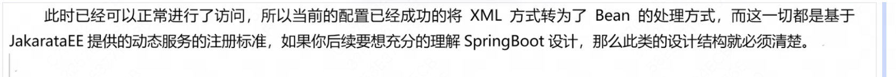

# WebApplicationContext

​	在Spring之中，容器的应用上下文是通过 `ApplicationContext`接口 表示的。Spring Web需要运行在Spring容器中，因此Spring提供了 `WebApplicationContext`子接口 应用上下文。

​	`ContextLoaderListener`监听器 实际上就是根据XML配置文件创建一个`XmlWebApplicationContext`实例 实现Spring容器的启动。


Spring启动过程


## 1.ContextLoaderListener

其源代码如下

```java
public class ContextLoaderListener extends ContextLoader implements ServletContextListener {
    public ContextLoaderListener() {
    }

    public ContextLoaderListener(WebApplicationContext context) {
        super(context);
    }

    public void contextInitialized(ServletContextEvent event) {
        this.initWebApplicationContext(event.getServletContext());
    }

    public void contextDestroyed(ServletContextEvent event) {
        this.closeWebApplicationContext(event.getServletContext());
        ContextCleanupListener.cleanupAttributes(event.getServletContext());
    }
}
```


1.它实现了 `ServletContextListener`接口，这个接口中定义了上下文的初始化和销毁方法

Web容器启动时通过上下文初始化方法实现Spring容器的启动

```java
public interface ServletContextListener extends EventListener {
    default void contextInitialized(ServletContextEvent sce) {
    }

    default void contextDestroyed(ServletContextEvent sce) {
    }
}
```


2.它继承了 `ContextLoader`类

其中维护了`WebApplicationContext` 也就是上下文实例

其中提供了容器启动的处理方法`initWebApplicationContext()`，我们具体分析这个方法


## 2.`initWebApplicationContext()`

方法根据**web应用上下文环境**来初始化Spring的`WebApplicationContext`

```java
public WebApplicationContext initWebApplicationContext(ServletContext servletContext) {}
```


首先检查Web上下文是否已经存在某个属性，如果存在则说明容器已经启动过了，抛出异常

```java
if (servletContext.getAttribute(WebApplicationContext.ROOT_WEB_APPLICATION_CONTEXT_ATTRIBUTE) != null) {
            throw new IllegalStateException("Cannot initialize context because there is already a root application context present - check whether you have multiple ContextLoader* definitions in your web.xml!");
        }
```


没有启动过则进入下面的流程：

创建WebApplicationContext实例，并且保存到本地变量表之中

```java
if (this.context == null) {
    this.context = this.createWebApplicationContext(servletContext);
}
```


调用方法`configureAndRefreshWebApplicationContext()`刷新Spring容器

```java
if (this.context instanceof ConfigurableWebApplicationContext) {
    ConfigurableWebApplicationContext cwac = (ConfigurableWebApplicationContext)this.context;
    if (!cwac.isActive()) {
        if (cwac.getParent() == null) {	// 没有父容器则获取并设置父容器
            ApplicationContext parent = this.loadParentContext(servletContext);
            cwac.setParent(parent);
        }

        this.configureAndRefreshWebApplicationContext(cwac, servletContext);	// 刷新处理
    }
}
```


保存Web属性

```java
servletContext.setAttribute(WebApplicationContext.ROOT_WEB_APPLICATION_CONTEXT_ATTRIBUTE, this.context);
```


获取当前线程的类加载器，如果当前类加载器就是Loader的加载器，那么把初始化完的上下文设置为`currentContext`；如果不是，则将类加载器和初始化完的上下文存储到currentContextPerThread，线程隔离。

```java
ClassLoader ccl = Thread.currentThread().getContextClassLoader();
if (ccl == ContextLoader.class.getClassLoader()) {
    currentContext = this.context;
} else if (ccl != null) {
    currentContextPerThread.put(ccl, this.context);
}
```


## 3.`configureAndRefreshWebApplicationContext()`

配置并刷新WebApplicationContext

wac为可配置的Web应用上下文，sc为当前Web应用上下文环境

```java
protected void configureAndRefreshWebApplicationContext(ConfigurableWebApplicationContext wac, ServletContext sc) {
```


configLocationParam是sc的上下文ID，若不为空，则设置其为wac的ID；若为空，则系统生成一个新的应用ID给wac

```java
String configLocationParam;
if (ObjectUtils.identityToString(wac).equals(wac.getId())) {
    configLocationParam = sc.getInitParameter("contextId");
    if (configLocationParam != null) {
        wac.setId(configLocationParam);
    } else {
        wac.setId(ConfigurableWebApplicationContext.APPLICATION_CONTEXT_ID_PREFIX + ObjectUtils.getDisplayString(sc.getContextPath()));
    }
}
```


在Web应用上下文中保存sc

```java
wac.setServletContext(sc);
```


从sc中读取**XML配置文件的路径**，并保存到wac中

```java
configLocationParam = sc.getInitParameter("contextConfigLocation");
if (configLocationParam != null) {
    wac.setConfigLocation(configLocationParam);
}
```


初始化属性源

```java
ConfigurableEnvironment env = wac.getEnvironment();
if (env instanceof ConfigurableWebEnvironment) {
    ((ConfigurableWebEnvironment)env).initPropertySources(sc, (ServletConfig)null);
}
```


初始化WebApplicationContext，刷新上下文

```java
this.customizeContext(sc, wac);
wac.refresh();
```


## 4.注解方式配置

​	从上面我们可以得知，Web中启动Spring容器的核心在于WebApplicationContext接口。SpringWeb在设计时考虑到了不同配置环境的需要，于是提供了XML配置和注解两种配置类：


​	XML文件配置的方式我们实际上前面做的就是，为了削弱XML配置文件的依赖，我们接下来用注解启动WEb应用上下文。这个操作主要依靠了Servlet之中的组件动态注册机制


### 1.WebApplicationInitializer

1.2.1 WebApplicationInitializer


1、【mvc子模块】删除所有xml配置文件

logback.xml别删除，这个日志不是spring容器提供的


2、【源代码】SpringWEB中提供了SpringServletContainerInitializer

```
package org.springframework.web;

@HandlesTypes({WebApplicationInitializer.class})
public class SpringServletContainerInitializer implements ServletContainerInitializer {}
```


ServletContainerInitializer是JavaEE提供的，是作为动态初始化配置的程序类。

```
package javax.servlet;

import java.util.Set;

public interface ServletContainerInitializer {
    void onStartup(Set<Class<?>> var1, ServletContext var2) throws ServletException;
}
```


```
package org.springframework.web;

import java.lang.reflect.Modifier;
import java.util.Iterator;
import java.util.LinkedList;
import java.util.List;
import java.util.Set;
import javax.servlet.ServletContainerInitializer;
import javax.servlet.ServletContext;
import javax.servlet.ServletException;
import javax.servlet.annotation.HandlesTypes;
import org.springframework.core.annotation.AnnotationAwareOrderComparator;
import org.springframework.lang.Nullable;
import org.springframework.util.ReflectionUtils;

@HandlesTypes({WebApplicationInitializer.class})
public class SpringServletContainerInitializer implements ServletContainerInitializer {
    public SpringServletContainerInitializer() {
    }

    public void onStartup(@Nullable Set<Class<?>> webAppInitializerClasses, ServletContext servletContext) throws ServletException {
        List<WebApplicationInitializer> initializers = new LinkedList(); // 在该类的视线里面会首先获取到所有的WebApplicationInitializer接口集合
        Iterator var4;
        if (webAppInitializerClasses != null) { // 判空
            var4 = webAppInitializerClasses.iterator();

            while(var4.hasNext()) {
                Class<?> waiClass = (Class)var4.next();
                if (!waiClass.isInterface() && !Modifier.isAbstract(waiClass.getModifiers()) && WebApplicationInitializer.class.isAssignableFrom(waiClass)) {
                    try {
                      	// 添加集合项
                        initializers.add((WebApplicationInitializer)ReflectionUtils.accessibleConstructor(waiClass, new Class[0]).newInstance());
                    } catch (Throwable var7) {
                        throw new ServletException("Failed to instantiate WebApplicationInitializer class", var7);
                    }
                }
            }
        }

        if (initializers.isEmpty()) { // 集合为空，后续直接返回
            servletContext.log("No Spring WebApplicationInitializer types detected on classpath");
        } else {
            servletContext.log(initializers.size() + " Spring WebApplicationInitializers detected on classpath");
            AnnotationAwareOrderComparator.sort(initializers);
            var4 = initializers.iterator();

            while(var4.hasNext()) {	// 启动配置
                WebApplicationInitializer initializer = (WebApplicationInitializer)var4.next();
                initializer.onStartup(servletContext);
            }

        }
    }
}
```

也就是说，只要代码中有提供WebApplicationInitializer实例就可以成功启动配置


3、【mvc子模块】创建一个WebApplicationInitializer接口的实现子类 

```
package i.love.wsq.web.config;

import java.util.EnumSet;
import javax.servlet.DispatcherType;
import javax.servlet.FilterRegistration;
import javax.servlet.ServletContext;
import javax.servlet.ServletException;
import javax.servlet.ServletRegistration;
import org.springframework.web.WebApplicationInitializer;
import org.springframework.web.context.support.AnnotationConfigWebApplicationContext;
import org.springframework.web.filter.CharacterEncodingFilter;
import org.springframework.web.servlet.DispatcherServlet;

/**
 * @author baitao05
 */
public class StartWEBApplication implements WebApplicationInitializer {
    @Override
    public void onStartup(ServletContext servletContext) throws ServletException {
        // 在该类之中可以直接获取到当前的ServletContext接口实例（WEB上下文对象）
        AnnotationConfigWebApplicationContext springContext = new AnnotationConfigWebApplicationContext(); // 注解上下文启动
        springContext.scan("i.love.wsq.action", "i.love.wsq.service");  // 配置扫描包
        springContext.refresh();    // 刷新上下文
        // 在SpringMVC里面需要设置有有一个DispatcherServlet分发处理类
        ServletRegistration.Dynamic servletRegistration = servletContext.addServlet("DispatcherServlet", new DispatcherServlet(springContext));
        servletRegistration.setLoadOnStartup(1);    //容器启动时加载
        servletRegistration.addMapping("/"); // 映射路径

        // 编码过滤器注册
        FilterRegistration.Dynamic filterRegistration = servletContext.addFilter("EncodingFilter", new CharacterEncodingFilter());
        filterRegistration.setInitParameter("encoding", "UTF-8");
        filterRegistration.setInitParameter("forceEncoding", "true");
        filterRegistration.addMappingForUrlPatterns(
                EnumSet.of(DispatcherType.REQUEST, DispatcherType.FORWARD), false, "/*"
        );
    }
}
```




### 2.AbstractAnnotationConfigDispatcherServletInitializer

抽象注解配置处理分发

在WebApplicationIntializer接口的实现那里，所有需要配置的Servlet和Filter可以直接在onStartup()方法中定义

考虑到更规范的开发设计需要，Spring Web提供了AbstractAnnotationConfigDispatcherServletInitializer抽象类，这个抽象类里面给了指定的方法去实现Spring配置类、Spring Web配置类、DispatcherServlet访问路径以及过滤器的配置定义。

于是我们实现的结构变成了这样


分别有spirng配置类，spring web配置类，如果需要基于扫描的方式启动Spring容器，就可以在相应的配置类上使用@ComponentScan注解进行定义


1、创建Spring上下文配置类

```
package i.love.wsq.context.config;

import org.springframework.context.annotation.ComponentScan;
import org.springframework.context.annotation.Configuration;

/**
 * @author baitao05
 */
@Configuration
@ComponentScan({"i.love.wsq.service", "i.love.wsq.config", "i.love.wsq.dao"})
public class SpringApplicationContextConfig {
}
```


2、创建Spring web上下文配置类

```
package i.love.wsq.context.config;

import org.springframework.context.annotation.ComponentScan;
import org.springframework.context.annotation.Configuration;

/**
 * @author baitao05
 */
@Configuration
@ComponentScan({"i.love.wsq.action"})
public class SpringWEBContextConfig {
}
```


3、创建自定义Web应用初始化配置类

```
package i.love.wsq.web.config;

import i.love.wsq.context.config.SpringApplicationContextConfig;
import i.love.wsq.context.config.SpringWEBContextConfig;
import javax.servlet.Filter;
import org.springframework.web.filter.CharacterEncodingFilter;
import org.springframework.web.servlet.support.AbstractAnnotationConfigDispatcherServletInitializer;

/**
 * @author baitao05
 */
public class StartWEBApplication extends AbstractAnnotationConfigDispatcherServletInitializer {
    @Override
    protected Class<?>[] getRootConfigClasses() {   // 获取spring容器启动类
        return new Class[] {SpringApplicationContextConfig.class};
    }

    @Override
    protected Class<?>[] getServletConfigClasses() { //SpringWeb容器启动类
        return new Class[] {SpringWEBContextConfig.class};
    }

    @Override
    protected String[] getServletMappings() {   // Dispatcher分发处理
        return new String[] {"/"};
    }

    @Override
    protected Filter[] getServletFilters() {    // 配置过滤器
        CharacterEncodingFilter encodingFilter = new CharacterEncodingFilter();
        encodingFilter.setEncoding("UTF-8"); // 编码设置
        encodingFilter.setForceEncoding(true); // 强制编码
        return new Filter[] {encodingFilter};
    }
}
```


4、【mvc子模块】既然已经配置完成了，且以上配置可以很好区分出父子容器逻辑关系，接下来尝试获取一些容器的相关内容

```
package i.love.wsq.action;

import i.love.wsq.service.IMessageService;
import org.slf4j.Logger;
import org.slf4j.LoggerFactory;
import org.springframework.beans.factory.annotation.Autowired;
import org.springframework.stereotype.Controller;
import org.springframework.web.bind.annotation.RequestMapping;
import org.springframework.web.context.WebApplicationContext;

/**
 * @author baitao05
 */
@Controller
public class ContextAction {
    private static final Logger LOGGER = LoggerFactory.getLogger(ContextAction.class);
    @Autowired
    private WebApplicationContext webApplicationContext; // WEB容器
    @Autowired
    private IMessageService messageService; // 业务接口实例
    @RequestMapping("/pages/context/show") // 映射地址
    public String show() {
        LOGGER.info("[子容器] ID:{}, NAME:{}", this.webApplicationContext.getId(), this.webApplicationContext.getApplicationName());
        LOGGER.info("[父容器] ID:{}, NAME:{}", this.webApplicationContext.getParent().getId(), this.webApplicationContext.getParent().getApplicationName());
        return null;
    }
}
```


[http-nio-8080-exec-7] INFO  i.love.wsq.action.ContextAction - [子容器] ID:org.springframework.web.context.WebApplicationContext:/dispatcher, NAME:

[http-nio-8080-exec-7] INFO  i.love.wsq.action.ContextAction - [父容器] ID:org.springframework.web.context.WebApplicationContext:, NAME:

