# 路径与参数接收


## 1.@RequestMapping注解

1.3 路径与参数接收

现在已经成功的实现了基于Bean方式进行SpringMVC项目启动了，于是下面应该回归到一个原始的状态，需要进一步去分析SpringMVC里面的各项组成，首先先从访问路径配置开始。在之前进行讲解的时候每一个控制层方法上都定义了注解@RequestMapping来对外提供服务支持

```
@RequestMapping("/pages/message/echo")
public ModelAndView echo(String msg) {
}
```


springMVC启动的时候，实际上也会自动地扫描所有的程序中的方法，而后这些路径的配置保存到一个Map集合之中，而后每一次访问的时候依据Map中的KEY（配置的注解路径），而后找到指定的方法进行反射调用处理。


在RequestMapping注解里面，会存在一个请求模式的配置，这个请求模式一旦定义之后，就意味着该路径可以被任意的请求模式所访问，POST GET PATCH都可


1、【mvc子模块】修改echo方法中的路径配置

像这样就会导致GET请求不能访问，POST请求可以

```
@RequestMapping(value = "/pages/message/echo", method = {RequestMethod.POST})
```

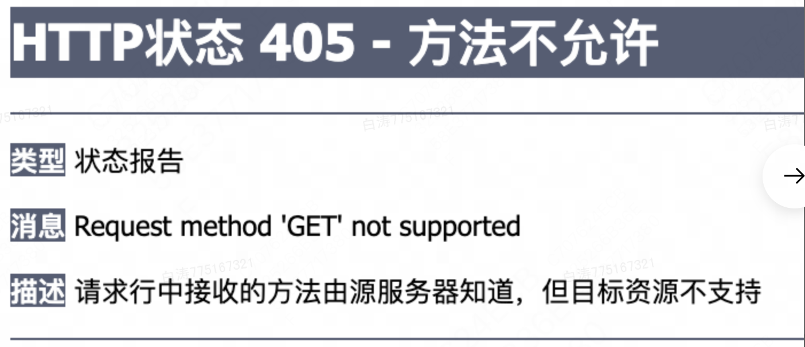


这个设置对于严谨的项目是必须的，我们公司也是有设置的，一般就只有GET和POST两种

严格控制每一种请求模式的设计要采用RESTful架构，也就是现在流行的前后端分离架构

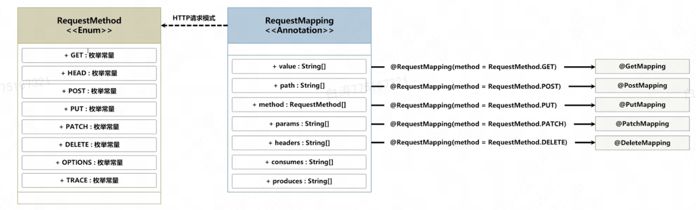


SpringMVC设计的时候，考虑到用户的方便，基于@RequestMapping注解又提供了各种访问控制的精细化注解配置，例如：@GetMapping、@PostMapping


2、【mvc子模块】使用简化的注解配置

```
@PostMapping(value = "/pages/message/echo")
```


3、【mvc子模块】如果有共同前缀路径，例如一个页面上的话，不妨把父路径提出来

@RequestMapping可以配置一个公共父路径，随后子方法配置子路径即可

```
package i.love.wsq.action;

import i.love.wsq.service.IMessageService;
import java.util.HashMap;
import java.util.Map;
import org.slf4j.Logger;
import org.slf4j.LoggerFactory;
import org.springframework.beans.factory.annotation.Autowired;
import org.springframework.stereotype.Controller;
import org.springframework.web.bind.annotation.GetMapping;
import org.springframework.web.bind.annotation.PostMapping;
import org.springframework.web.bind.annotation.RequestMapping;
import org.springframework.web.bind.annotation.RequestMethod;
import org.springframework.web.servlet.ModelAndView;

/**
 * @author baitao05
 */
@Controller // 控制层注解
@RequestMapping("/pages/message")
public class MessageAction {
    private static Logger LOGGER = LoggerFactory.getLogger(MessageAction.class);

    @Autowired
    private IMessageService messageService;     // 注入实例

    @GetMapping(value = "/echo")
    public ModelAndView echo(String msg) {

        LOGGER.info("消息回应处理 msg = {}", msg);
        ModelAndView modelAndView = new ModelAndView();
        modelAndView.setViewName("/pages/message/show.jsp");

        //构建信息
        Map<String, Object> result = new HashMap<>();
        result.put("echoMessage", this.messageService.echo(msg));
        result.put("id", "baitao05");
        result.put("edu", "bupt");

        // 保存信息
        modelAndView.addAllObjects(result);
        return modelAndView;
    }

    @PostMapping("/add")
    public String add() {
        return null;
    }

    @PostMapping("/edit")
    public String edit() {
        return null;
    }

    @PostMapping("/delete")
    public String delete() {
        return null;
    }

}
```


## 2.表单提交

动态WEB开发最为重要的一项技术点就在于表单交互性，利用表单输入所需要的内容项（不管是文字、语音或者是图像实际上都是输入）

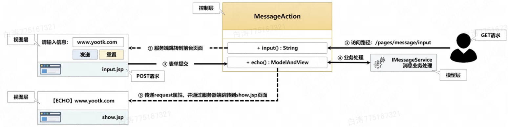

我们在项目中创建input.jsp页面，用来输入内容，随后把输入的内容显示


1、【mvc子模块】修改MessageAction方法，我们定义两个处理方法

```java
package i.love.wsq.action;

import i.love.wsq.service.IMessageService;
import java.util.HashMap;
import java.util.Map;
import org.slf4j.Logger;
import org.slf4j.LoggerFactory;
import org.springframework.beans.factory.annotation.Autowired;
import org.springframework.stereotype.Controller;
import org.springframework.web.bind.annotation.GetMapping;
import org.springframework.web.bind.annotation.PostMapping;
import org.springframework.web.bind.annotation.RequestMapping;
import org.springframework.web.bind.annotation.RequestMethod;
import org.springframework.web.servlet.ModelAndView;

/**
 * @author baitao05
 */
@Controller // 控制层注解
@RequestMapping("/pages/message")
public class MessageAction {
    private static Logger LOGGER = LoggerFactory.getLogger(MessageAction.class);

    @Autowired
    private IMessageService messageService;     // 注入实例

    @GetMapping("input")
    public String input() {
        // 此处不进行任何属性传递，直接返回字符串路径，进入表单页面
        return "/pages/message/input.jsp";
    }

    @PostMapping(value = "/echo")
    public ModelAndView echo(String msg) {
        LOGGER.info("消息回应处理 msg = {}", msg);
        ModelAndView modelAndView = new ModelAndView("/pages/message/show.jsp");
        modelAndView.addObject("echoMessage", this.messageService.echo(msg));
        return modelAndView;
    }
}

```


2、【mvc子模块】创建消息的输入表单


```jsp
<%@ page contentType="text/html;charset=UTF-8" language="java" %>
<html>
<head>
    <title>Title</title>
</head>
<body>
    <form action="${request.contextPath}/pages/message/echo" method="post">
        请输入信息： <input type="text" name="msg" value="I Love Wsq">
        <button type="submit">发送</button>
    </form>
</body>
</html>

```


3、【mvc子模块】修改show.jsp页面

```java
<%@ page contentType="text/html;charset=UTF-8" language="java" %>
<html>
<head>
    <title>Title</title>
</head>
<body>
    <h1>${echoMessage}</h1>
</body>
</html>
```


4、【浏览器】访问

http://localhost:8080/pages/message/input ：用一个get请求，但是没任何参数，只是负责return到指定的表单输入页面

http://localhost:8080/pages/message/echo ：由表单发出的post请求，一样也会被dispatcherSerlet按路径分发，所以能够到show.jsp


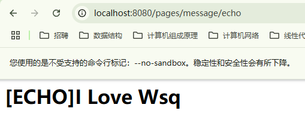


## 3.@RequestParam

在SpringMVC的控制层里面，如果要想接收某些请求参数，直接将参数定义在方法之中即可，在每次进行HTTP请求提交的时候，会自动的将该请求中指定参数的名称与方法中的参数名称进行匹配，匹配成功后即可实现参数内容的注入


​	标题2 中的例子观察可以发现，表单输入信息和Post方法的参数是对应的，都是msg

```html
请输入信息： <input type="text" name="msg" value="I Love Wsq">
```

```java
@PostMapping(value = "/echo")
public ModelAndView echo(String msg) {
}
```


​	如果方法中的参数和用户请求的参数不同，则不能正确接收，这时候需要利用`@RequestParam`注解来绑定参数名称

​	需要注意，

1、【mvc子模块】修改MessageAction.echo()

使其接收GET请求

设置参数

```java
    @GetMapping(value = "/echo")
    public ModelAndView echo(@RequestParam("message") String msg) {
        LOGGER.info("消息回应处理 msg = {}", msg);
        ModelAndView modelAndView = new ModelAndView("/pages/message/show.jsp");
        modelAndView.addObject("echoMessage", this.messageService.echo(msg));
        return modelAndView;
    }
```

【浏览器】访问

http://localhost:8080/pages/message/echo?msg=I%20Love%20Wsq

http://localhost:8080/pages/message/echo?message=I%20Love%20Wsq

发现上面的不行，下面的可以，这就是参数绑定


当然如果不写@RequestParam注解的话，默认用户提交的参数就和控制层方法的参数同名了


2、【mvc子模块】使用@RequestParam配置默认值

```java
    @GetMapping(value = "/echo")
    public ModelAndView echo(@RequestParam(value = "message", defaultValue = "I Love Wsq") String msg) {
        LOGGER.info("消息回应处理 msg = {}", msg);
        ModelAndView modelAndView = new ModelAndView("/pages/message/show.jsp");
        modelAndView.addObject("echoMessage", this.messageService.echo(msg));
        return modelAndView;
    }
```

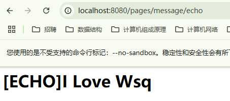

也就是说如果有默认值配置的需求，就可以使用@RequestParam注解


## 4.@PathVariable

按照传统的请求参数的提交来讲，都是基于GET、POST等模式发送的，但是SpringMVC在设计的时候充分考虑到了RESTful设计要求，所以可以通过路径的形式传递所需要的参数内容

1、【mvc子模块】MessageAction

可以将路径的内容作为捆绑参数，这种参数传递在豆瓣能见到

```java
    @GetMapping(value = "/echo/{title}/{info}/{level}")
    public ModelAndView echo(
            @PathVariable(name = "title") String title,
            @PathVariable("info") String info,
            @PathVariable("level") String level) {
        LOGGER.info("消息回应处理 title = {}", title);
        LOGGER.info("消息回应处理 info = {}", info);
        LOGGER.info("消息回应处理 level = {}", level);
        return null;
    }
```


访问路径，可以看到日志里的信息

http://localhost:8080/pages/message/echo/title/info/level

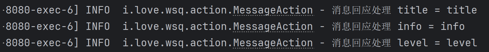


在一些开发要求比较严格的环境，会进行严格路径组成的定义


## 5.@MatrixVariable

矩阵参数，是一种SpringMVC扩展的参数接收形式，这类参数传递模式”参数名称=内容;参数名称=内容;“

这个参数没有默认开启，所以需要手动开启

1、【mvc子模块】修改SpringWEBContextConfig，使其实现一个接口WebMvcConfigurer

这个接口

```java
package i.love.wsq.context.config;

import org.springframework.context.annotation.ComponentScan;
import org.springframework.context.annotation.Configuration;
import org.springframework.web.servlet.config.annotation.EnableWebMvc;
import org.springframework.web.servlet.config.annotation.PathMatchConfigurer;
import org.springframework.web.servlet.config.annotation.WebMvcConfigurer;
import org.springframework.web.util.UrlPathHelper;

/**
 * @author baitao05
 */
@Configuration
@EnableWebMvc // 加入此注解才表示WEBMVC配置类有效
@ComponentScan({"i.love.wsq.action"})
public class SpringWEBContextConfig implements WebMvcConfigurer {
    @Override
    public void configurePathMatch(PathMatchConfigurer configurer) { // 矩阵参数的配置
        UrlPathHelper urlPathHelper = new UrlPathHelper(); // 配置一个对象
        urlPathHelper.setRemoveSemicolonContent(false); // 启用矩阵参数接收
        configurer.setUrlPathHelper(urlPathHelper); // 配置路径参数
    }
}
```


2、【mvc子模块】修改MessageAction，使其接收矩阵参数

```java
package i.love.wsq.action;

import i.love.wsq.service.IMessageService;
import java.util.HashMap;
import java.util.Map;
import org.slf4j.Logger;
import org.slf4j.LoggerFactory;
import org.springframework.beans.factory.annotation.Autowired;
import org.springframework.stereotype.Controller;
import org.springframework.web.bind.annotation.*;
import org.springframework.web.servlet.ModelAndView;

/**
 * @author baitao05
 */
@Controller // 控制层注解
@RequestMapping("/pages/message")
public class MessageAction {
    private static Logger LOGGER = LoggerFactory.getLogger(MessageAction.class);

    @Autowired
    private IMessageService messageService;     // 注入实例

    @GetMapping(value = "/echo/{mid}")
    public ModelAndView echo(
            @PathVariable(name = "mid") String mid, // 绑定路径参数
            @MatrixVariable("title") String title,
            @MatrixVariable("content") String content,
            @MatrixVariable("level") int level) {
        LOGGER.info("消息回应处理 mid = {}", mid);
        LOGGER.info("消息回应处理 title = {}", title);
        LOGGER.info("消息回应处理 content = {}", content);
        LOGGER.info("消息回应处理 level = {}", level);
        return null;
    }
}
```


访问路径

http://localhost:8080/pages/message/echo/baitao05;title=%E6%A0%87%E9%A2%98;content=%E5%86%85%E5%AE%B9;level=666

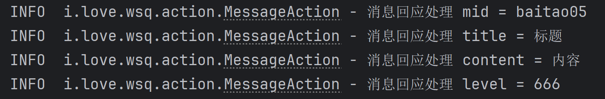


3、【mvc子模块】另一种矩阵参数接收，Map集合

```java
package i.love.wsq.action;

import i.love.wsq.service.IMessageService;
import java.util.HashMap;
import java.util.Map;
import org.slf4j.Logger;
import org.slf4j.LoggerFactory;
import org.springframework.beans.factory.annotation.Autowired;
import org.springframework.stereotype.Controller;
import org.springframework.web.bind.annotation.*;
import org.springframework.web.servlet.ModelAndView;

/**
 * @author baitao05
 */
@Controller // 控制层注解
@RequestMapping("/pages/message")
public class MessageAction {
    private static Logger LOGGER = LoggerFactory.getLogger(MessageAction.class);

    @Autowired
    private IMessageService messageService;     // 注入实例

    @GetMapping(value = "/echo_map/{.*}")
    public ModelAndView echo(
            @MatrixVariable Map<String, String> params) {
        for (Map.Entry<String, String> entry : params.entrySet()) {
            LOGGER.info("消息回应处理 {} = {}", entry.getKey(), entry.getValue());
        }
        return null;
    }
}

```

访问路径

http://localhost:8080/pages/message/echo_map/title=%E6%A0%87%E9%A2%98;content=%E5%86%85%E5%AE%B9;level=666

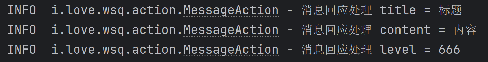


## 6.@InitBinder

1、【mvc】增加表单输入的内容

```jsp
<%@ page contentType="text/html;charset=UTF-8" language="java" %>
<html>
<head>
    <title>Title</title>
</head>
<body>
    <form action="${request.contextPath}/pages/message/echo" method="post">
        请输入信息:
        <input type="text" name="message" value="I Love Wsq"><br>

        消息级别:
        <select id="level" name="level">
            <option value="0">紧急</option>
            <option value="1">普通</option>
            <option value="2">延迟</option>
        </select><br>

        发布日期：
        <input type="date" id="pubDate" name="pubDate" value="2025-02-18"><br>

        消息标签：
        <input type="checkbox" name="tags" id="tags" value="政治" checked>政治
        <input type="checkbox" name="tags" id="tags" value="经济" checked>经济
        <input type="checkbox" name="tags" id="tags" value="文化" checked>文化

        <button type="submit">发送</button>
        <button type="reset">重置</button>
    </form>
</body>
</html>

```


2、【mvc子模块】定义MessageAction程序类，使其进行消息内容的接收和跳转

```java
package i.love.wsq.action;

import i.love.wsq.service.IMessageService;
import java.util.Date;
import java.util.HashMap;
import java.util.Map;
import org.slf4j.Logger;
import org.slf4j.LoggerFactory;
import org.springframework.beans.factory.annotation.Autowired;
import org.springframework.stereotype.Controller;
import org.springframework.web.bind.annotation.*;
import org.springframework.web.servlet.ModelAndView;

/**
 * @author baitao05
 */
@Controller // 控制层注解
@RequestMapping("/pages/message")
public class MessageAction {
    private static Logger LOGGER = LoggerFactory.getLogger(MessageAction.class);

    @Autowired
    private IMessageService messageService;     // 注入实例

    @GetMapping("/input")
    public String input() {
        return "/pages/message/input.jsp";
    }

    @PostMapping(value = "/echo")
    public ModelAndView echo(String message, Integer level, Date pubDate) {
        LOGGER.info("信息: {}", message);
        LOGGER.info("等级: {}", level);
        LOGGER.info("发布日期: {}", pubDate);
        return null;
    }

}

```


3、访问路径http://localhost:8080/pages/message/input

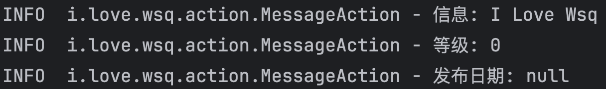


Spring开发框架内部提供有大量的数据转换处理支持的，SpringMVC继承了Spring框架的使用特点，也包含有这样的处理转换操作，所以每一次进行请求参数传递的时候都可以自动将其转为控制层方法对应的数据类型，但是==**日期时间**==不能直接控制，日期时间需要人为定义格式

实际上很多的控制层类都需要处理日期，既然有这样的需求，我们不妨对这个功能作出抽象，实际上按照标准的设计来说，控制层业务层数据层都应当有一个抽象类的继承结构，只不过这里从简了


4、【mvc子模块】创建一个控制层公共抽象类

```java
package i.love.wsq.action.abs;

import java.beans.PropertyEditorSupport;
import java.time.Instant;
import java.time.LocalDate;
import java.time.ZoneId;
import java.time.format.DateTimeFormatter;
import org.springframework.web.bind.WebDataBinder;
import org.springframework.web.bind.annotation.InitBinder;

/**
 * @author baitao05
 */
public abstract class AbstractAction {
    // 父类统一配置格式，如果子类另有配置，子配置优先生效
    private static final DateTimeFormatter LOCAL_DATE_FORMAT = DateTimeFormatter.ofPattern("yyyy-MM-dd");

    @InitBinder // 添加初始化绑定注解
    public void initBinder(WebDataBinder binder) {
        binder.registerCustomEditor(java.util.Date.class, new PropertyEditorSupport() {
            @Override
            public void setAsText(String text) throws IllegalArgumentException {
                LocalDate localDate = LocalDate.parse(text, LOCAL_DATE_FORMAT);
                Instant instant = localDate.atStartOfDay().atZone(ZoneId.systemDefault()).toInstant();
                super.setValue(java.util.Date.from(instant));
            }
        });
    }
}

```


5、【mvc子模块】修改MessageAction，继承公共抽象类


6、访问路径

http://localhost:8080/pages/message/input

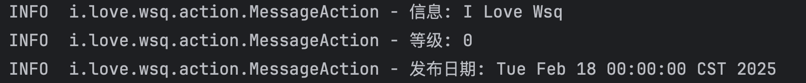


## 7.@ModelAttribute

​	现在的程序开发，在控制层代码之中，如果要进行用户的请求，往往会进行请求的处理，而后利用ModelAndView传递所需要的属性内容

1、【mvc子模块】MessageAction

```java
    @PostMapping(value = "/echo")
    public ModelAndView echo(String message, Integer level, Date pubDate) {
        ModelAndView modelAndView = new ModelAndView("/pages/message/show.jsp");
        modelAndView.addObject("msg", message);
        modelAndView.addObject("level", level);
        modelAndView.addObject("pubDate", pubDate);
        return modelAndView;
    }
```


有些设计者认为，这个echo()方法管的内容有些多了，应该把数据处理和跳转分开

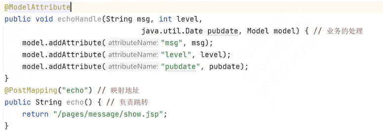


感觉没什么卵用


## 8.RedirectAttributes

重定向属性

JavaWeb开发中会存在不同路径得之间的访问链接，利用客户端跳转可以跳转到其他的路径，而对于跳转除了客户端的支持之外，还有服务端