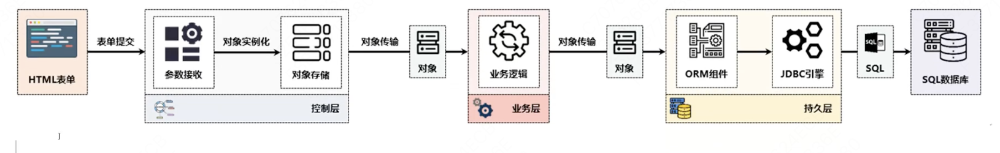

# 对象转换支持

传统的MVC开发之中，应用程序都是以对象的形式进行传输的，例如：在控制层调用业务层的时候，会将对象传递给业务层， 业务层调用数据层也会传递对象。

如果按照原始的做法，用户需要将控制层接收的参数转换为对象，自己new自己set



​	实际上前端传递给后端的无非就是GET请求的参数，或者POST请求利用request body传递的参数。Spring MVC考虑到了这种应用的普遍性。

对象的形式，包括POJO、PO、VO、TO，Java的语法上来说都差不多，只是由于添加了不同的接口和不同的注解，所以有了区别

POJO：最古老的简单Java类

PO：JPA提供的持久化对象

VO：保存数据的对象，一般与数据表的结构映射

TO：传输对象，也有称为DTO的，提供了序列化接口的简单Java类

这里我们使用的是VO


我们实现上面这个图的结构：雇员和部门类

1、【mvc子模块】在src/main/webapps中创建表单"pages/emp/emp_add.jsp"

```jsp
<%@ page contentType="text/html;charset=UTF-8" language="java" %>
<html>
<head>
    <title>Title</title>
</head>
<body>
    <form action="${request.contextPath}/pages/emp/add" method="post">
        雇员编号：<input type="text" name="empNo" value="123">
        雇员姓名：<input type="text" name="empName" value="白涛">
        雇佣日期：<input type="date" name="empDate" value="2033-09-18">
        部门编号：<input type="text" name="dept.deptNo" value="10"><br>
        部门位置：<input type="text" name="dept.dName" value="教学部"><br>
        部门位置：<input type="text" name="dept.loc" value="洛阳"><br>
        <button type="submit">提交</button>
    </form>
</body>
</html>
```


2、【mvc子模块】信息展示页面

```jsp
<%@ page contentType="text/html;charset=UTF-8" language="java" %>
<html>
<head>
    <title>Title</title>
</head>
<body>
    <form action="${request.contextPath}/pages/emp/add" method="post">
        雇员编号：<input type="text" name="empNo" value="123">
        雇员姓名：<input type="text" name="empName" value="白涛">
        雇佣日期：<input type="date" name="empDate" value="2033-09-18">
        部门编号：<input type="text" name="dept.deptNo" value="10"><br>
        部门名称：<input type="text" name="dept.dName" value="教学部"><br>
        部门位置：<input type="text" name="dept.loc" value="洛阳"><br>
        <button type="submit">提交</button>
        <button type="reset">重置</button>
    </form>
</body>
</html>

```


3、【mvc子模块】Dept类

4、【mvc子模块】Emp类

5、【mvc子模块】EmpAction控制器

```java
package i.love.wsq.action;

import com.sun.org.apache.xpath.internal.operations.Mod;
import i.love.wsq.action.abs.AbstractAction;
import i.love.wsq.vo.Emp;
import org.slf4j.Logger;
import org.slf4j.LoggerFactory;
import org.springframework.stereotype.Controller;
import org.springframework.ui.Model;
import org.springframework.web.bind.annotation.RequestMapping;
import org.springframework.web.servlet.ModelAndView;

/**
 * @author baitao05
 */
@Controller
@RequestMapping("/pages/emp")
public class EmpAction extends AbstractAction {
    private static final Logger LOGGER = LoggerFactory.getLogger(EmpAction.class);

    @RequestMapping("/add_input")
    public String addInput() {
        return "/pages/emp/emp_add.jsp";
    }

    @RequestMapping("/add")
    public ModelAndView add(Emp emp) {
        LOGGER.info("入参: {}", emp);
        ModelAndView modelAndView = new ModelAndView("/pages/emp/emp_add_show.jsp");
        modelAndView.addObject("emp", emp);
        return modelAndView;
    }

}
```


6、访问浏览器

http://localhost:8080/pages/emp/add_input


此时你会发现，我们压根没有去处理类，springMVC就自动完成了转换服务。


## 1.RequestBody参数

现在我们多数面临的是前后端分离的WEB应用，后台应用程序只是负责控制层、业务层、数据层的开发，但是不开关于前端显示，前后端之间依靠JSON来传递数据。


​	前后端分离的架构中数据交互格式一定是JSON，用户在前端应用里面所提交的表单的内容会自动拼凑成对应的JSON数据，并利用一个远程组件（Axios）发送给服务端，一般来讲这些操作都属于跨域访问的形式。

​	如果前端发的是JSON，那么就需要我们把JSON转换为对象的实例，这个时候控制层就没法简单以对象为参数，而是需要用@RequestBody注解定义

### 1.JSON数据的解析

我们第一步需要JSON的解析，我们需要用Spring内置推荐的Jackson依赖库。


1、【mvc子模块】引入Jackson依赖库

```xml
<!--jackson库-->
<dependency>
    <groupId>com.fasterxml.jackson.core</groupId>
    <artifactId>jackson-databind</artifactId>
    <version>2.13.5</version>
</dependency>
<dependency>
    <groupId>com.fasterxml.jackson.core</groupId>
    <artifactId>jackson-core</artifactId>
    <version>2.13.5</version>
</dependency>
<dependency>
    <groupId>com.fasterxml.jackson.core</groupId>
    <artifactId>jackson-annotations</artifactId>
    <version>2.13.5</version>
</dependency>
<dependency>
    <groupId>com.fasterxml.jackson.datatype</groupId>
    <artifactId>jackson-datatype-jsr310</artifactId>
    <version>2.13.5</version>
</dependency>
```


2、配置转换器

```java
package i.love.wsq.config;

import java.util.ArrayList;
import java.util.List;
import org.springframework.http.MediaType;
import org.springframework.http.converter.HttpMessageConverter;
import org.springframework.http.converter.json.MappingJackson2HttpMessageConverter;
import org.springframework.web.servlet.mvc.method.annotation.RequestMappingHandlerAdapter;

/**
 * @author baitao05
 */
public class JacksonConfig { // JSON配置类
    public RequestMappingHandlerAdapter requestMappingHandlerAdapter() {
        RequestMappingHandlerAdapter adapter = new RequestMappingHandlerAdapter();
        MappingJackson2HttpMessageConverter converter = new MappingJackson2HttpMessageConverter();
        List<MediaType> supportedMediaTypes = new ArrayList();
        supportedMediaTypes.add(MediaType.APPLICATION_JSON);
        converter.setSupportedMediaTypes(supportedMediaTypes);
        List<HttpMessageConverter<?>> messageConverters = new ArrayList<>();
        messageConverters.add(converter);
        adapter.setMessageConverters(messageConverters);
        return adapter;
    }
}

```

​	现在Java开发可能很少看见使用Spring MVC了，而是使用了Spring Boot。Spring Boot只是简化了用户的配置，可是内部的配置并没有减少。


3、【mvc子模块】修改EmpAction程序类，在这个程序类之中重点接收两类数据，一个是EMp对象实例，另一个是List集合接收

```java
package i.love.wsq.action;

import com.sun.org.apache.xpath.internal.operations.Mod;
import i.love.wsq.action.abs.AbstractAction;
import i.love.wsq.vo.Emp;
import java.util.List;
import org.slf4j.Logger;
import org.slf4j.LoggerFactory;
import org.springframework.stereotype.Controller;
import org.springframework.ui.Model;
import org.springframework.web.bind.annotation.RequestBody;
import org.springframework.web.bind.annotation.RequestMapping;
import org.springframework.web.servlet.ModelAndView;

/**
 * @author baitao05
 */
@Controller
@RequestMapping("/pages/emp")
public class EmpAction extends AbstractAction {
    private static final Logger LOGGER = LoggerFactory.getLogger(EmpAction.class);

    @RequestMapping("/add")
    public ModelAndView add(@RequestBody List<Emp> empList) { // 接收一组雇员信息
        // @RequestBody的目的就是告诉控制层，此时传输的是JSON数据
        // 需要通过Jackson来转换
        for (Emp emp : empList) {
            LOGGER.info("入参: {}", emp);
        }
        return null;
    }
}
```

​	到这里，一个Java后端工程师的工作就结束了


4、【mvc子模块】利用curl命令，这个命令可以模拟HTTP请求

```sh
curl -X POST "http://localhost:8080/pages/emp/add" -H "Content-Type:application/json;charset=utf-8" -d "[{\"empNo\":1234,\"empName\":\"baitao05\",\"empdate\":\"2025-09-18\",\"dept\":{\"deptNo\":123,\"dName\":\"教学部\",\"loc\":\"洛阳\"}}]"
```

可以在日志中找到信息


## 3.@ResponseBody

​	在前后端分离的架构中，使用JSON作为前后端的


