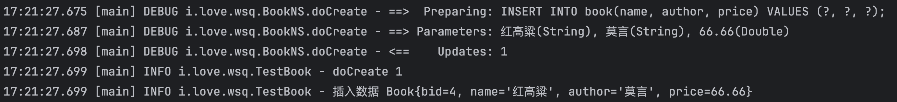

# 3.1 MyBatis编程起步

## 1.开发MyBatis应用

​	MyBatis需要数据库连接配置文件，SQL程序文件等


​	我们一般将直接和数据表映射的类称为domain类，业务层与domain类映射的类称为Bo，前后端传递的是Vo


1.创建本地数据库的数据表

```sql
DROP DATABASE IF EXISTS i_love_wsq;
CREATE DATABASE i_love_wsq CHARACTER SET UTF8;
USE i_love_wsq;
CREATE TABLE book(
    bid BIGINT AUTO_INCREMENT comment '图书编号',
    name VARCHAR(50) comment '图书名称',
    author VARCHAR(50) comment '图书作者',
    price DOUBLE comment '图书价格',
    CONSTRAINT pk_pid PRIMARY KEY (bid)
) engine=innodb;
```


2.【ssm项目】创建mybatis子模块，补充依赖库

```xml
<dependency>
    <groupId>mysql</groupId>
    <artifactId>mysql-connector-java</artifactId>
    <version>5.1.47</version>
</dependency>
<dependency>
    <groupId>org.mybatis</groupId>
    <artifactId>mybatis</artifactId>
    <version>3.4.1</version>
</dependency>
```


3.【mybatis子模块】 创建与book数据表结构相同的Book类

```java
package i.love.wsq.domain;

public class Book {
    private Long bid;
    private String name;
    private String author;
    private Double price;
  
  // getter, setter略
}
```


4.【mybatis子模块】在resources中创建映射文件Book.xml（Mapper），用于定义当前操作要使用的SQL语句

```xml
<?xml version="1.0" encoding="UTF-8"?>
<!DOCTYPE mapper PUBLIC "-//mybatis.org//DTD Mapper 3.0//EN"
        "http://mybatis.org/dtd/mybatis-3-mapper.dtd">
<!-- 设置命名空间，可以与不同表的同类型操作进行区分，使用时以“空间名称.id”的方式调用 -->
<mapper namespace="i.love.wsq.BookNS">
    <!-- 定义增加数据的操作配置，同时指定参数类型 -->
    <!-- 此处的id表示的是用户操作时指定标记，SQL操作时：“BookNS.doCreate” -->
    <!-- parameterType指的是参数的类型，此时应该操作的是简单Java类 -->
    <insert id="doCreate" parameterType="i.love.wsq.domain.Book">
        INSERT INTO book(name, author, price) VALUES (#{name}, #{author}, #{price});
    </insert>
</mapper>
```

​	映射文件是MyBatis中SQL命令定义的核心配置文件。

​	一个项目中可能需要用到很多张数据表，为了对每张表的SQL命令进行区分管理，我们会用一个映射文件对应一个数据表，映射文件中定义独有的命名空间。

​	映射文件中的SQL命令有一个id，当我们需要数据操作时，利用“命名空间.id”的格式找到对应的SQL语句。

​	映射文件中的SQL语句可以用paramType指定操作的类，并且利用`#{}`的格式获取对象实例的成员属性


5、【mybatis子模块】在resources目录中创建mybatis/mybatis.cfg.xml配置文件，用于定义要链接的数据库和配置Mapper文件的加载路径

```xml
<?xml version="1.0" encoding="UTF-8" ?>
<!DOCTYPE configuration
        PUBLIC "-//mybatis.org//DTD Config 3.0//EN"
        "http://mybatis.org/dtd/mybatis-3-config.dtd">
<configuration>
    <environments default="development"> 		<!-- 定义数据库连接池 -->
        <environment id="development"> 		<!-- 数据库资源配置 -->
            <transactionManager type="jdbc" /> 	<!-- JDBC事务管理 -->
            <!-- 定义数据源，MyBatis内部提供有三种数据源的支持，分别为： -->
            <!-- POOLED：采用MyBatis内置的连接池进行数据库连接管理 -->
            <!-- UNPOOLED：不使用连接池管理数据库连接 -->
            <!-- JNDI：引入外部的数据库连接池配置 -->
            <dataSource type="POOLED">		<!-- 配置数据源 -->
                <!-- 数据库的驱动程序路径，配置的mysql驱动包中的类名称 -->
                <property name="driver" value="com.mysql.jdbc.Driver" />
                <!-- 数据库的连接地址 -->
                <property name="url" value="jdbc:mysql://localhost:3306/i_love_wsq" />
                <!-- 数据库连接的用户名 -->
                <property name="username" value="root" />
                <!-- 数据库的连接密码 -->
                <property name="password" value="baitao1597530B!" />
            </dataSource>
        </environment>
    </environments>
    <mappers>  					<!-- 配置SQL映射文件路径 -->
        <mapper resource="mybatis/mapper/Book.xml" />  <!-- 映射文件路径 -->
    </mappers>
</configuration>
```


6、【mybatis子模块】编写测试类实现数据增加操作

​	SqlSessionFactoryBuilder可以根据输入流加载MyBatis核心配置文件，并提供SqlSessionFactory接口。

​	SqlSessionFactory接口用来开启会话连接。

​	SqlSession用来执行SQL命令，因为在核心配置中有加载Mapper，因此可以通过Mapper文件中的"命名空间.id"找到指定的SQL命令。（本质上就是用JDBC提供的PreparedStatement接口完成数据操作）

```java
package i.love.wsq;

import i.love.wsq.domain.Book;
import java.io.InputStream;
import org.apache.ibatis.session.SqlSession;
import org.apache.ibatis.session.SqlSessionFactory;
import org.apache.ibatis.session.SqlSessionFactoryBuilder;
import org.junit.Test;
import org.slf4j.Logger;
import org.slf4j.LoggerFactory;
import org.apache.ibatis.io.Resources;

/**
 * @author baitao05
 */
public class TestBook {
    private static final Logger LOGGER = LoggerFactory.getLogger(TestBook.class);

    @Test
    public void testDoCreate() throws Exception {
        InputStream input = Resources.getResourceAsStream("mybatis/mybatis.cfg.xml");
        SqlSessionFactory sessionFactory = new SqlSessionFactoryBuilder().build(input);
        SqlSession session = sessionFactory.openSession();
        Book book = new Book(1L, "永乐大典", "解缙", 99.99);
        LOGGER.info("doCreate {}", session.insert("i.love.wsq.BookNS.doCreate", book));
        session.commit();
        session.close();
        input.close();
    }
}
```

​	


## 2.MyBatis连接工厂

​	MyBatis中的数据处理操作都需要SqlSession接口，而该接口的实例需要通过SqlSessionFactoryBuilder类提供的build()方法实现。为了方便，我们可以建立一个工厂类，调用工厂类来获取接口实例。

​	由于实际的项目中每一个线程都需要自己的数据库连接和事务控制方法，因此我们在工厂类中提供一个ThreadLocal实例，保证即便某一个线程多次调用了getSession()方法，最终返回的也是同一个SqlSession接口实例，便于用户使用和关闭处理

​	如果不知道ThreadLocal可以看看另一篇

```java
package i.love.wsq.util;

import java.io.IOException;
import java.util.Objects;
import org.apache.ibatis.io.Resources;
import org.apache.ibatis.session.SqlSession;
import org.apache.ibatis.session.SqlSessionFactory;
import org.apache.ibatis.session.SqlSessionFactoryBuilder;

/**
 * @author baitao05
 */
public class MyBatisSessionFactory {
    private static final String CONFIG_FILE = "mybatis/mybatis.cfg.xml"; // 配置文件
    private static SqlSessionFactory sessionFactory;
    private static final ThreadLocal<SqlSession> SESSION_THREAD_LOCAL = new ThreadLocal<>();

    static {
        try {
            sessionFactory = new SqlSessionFactoryBuilder().build(Resources.getResourceAsStream(CONFIG_FILE));
        } catch (IOException e) {
            throw new RuntimeException(e);
        }
    }

    public static SqlSession getSession() {
        SqlSession session = SESSION_THREAD_LOCAL.get();
        if (Objects.isNull(session)) {
            session = sessionFactory.openSession();
            SESSION_THREAD_LOCAL.set(session);
        }
        return session;
    }

    public static void close() {
        SqlSession session = SESSION_THREAD_LOCAL.get();
        if (Objects.nonNull(session)) {
            session.close();
            SESSION_THREAD_LOCAL.remove();
        }
    }

    public static SqlSessionFactory getSessionFactory() {
        return sessionFactory;
    }
}
```


## 3.别名配置

​	Mapper文件中的paramType现在使用的是完整的类名，有人觉得这样太麻烦了。

​	可以在核心配置文件中为类配置别名

​	在configuration标签下使用typeAliases标签，这个标签有两种配置方法

### 1.自定义

```xml
  <typeAliases>
      <typeAlias type="i.love.wsq.domain.Book" alias="Book"/>
  </typeAliases>
```

手动指定别名


### 2.省略包路径

```xml
<typeAliases>
    <package name="i.love.wsq.domain"/>
</typeAliases>
```

对这个包下下的类省略路径，以类名直接作为别名


​	之后在mapper中可以用更简单的方式写paramType

```xml
<insert id="doCreate" parameterType="Book">
    INSERT INTO book(name, author, price) VALUES (#{name}, #{author}, #{price});
</insert>
```


## 4.获取生成主键

​	前面建表的时候我们设置了自动生成主键，很多情况下我们insert数据之后会需要返回主键，这需要我们在Mapper文件中配置

```xml
<insert id="doCreate" parameterType="Book" keyProperty="bid" keyColumn="bid" useGeneratedKeys="true">
    INSERT INTO book(name, author, price) VALUES (#{name}, #{author}, #{price});
</insert>
```

​	keyProperty：主键成员属性名称

​	keyColumn：主键列字段

​	useGeneratedKeys：主键启用

这时候你就能发现，插入后的Book类多出来了bid值




​	如果是oracle数据库会有特殊处理，我没钱买就不看了


