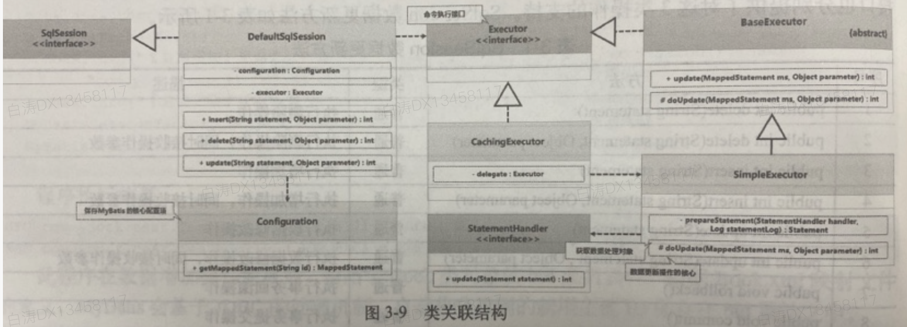

# MyBatis的数据库操作

## 1.分析SqlSession的工作原理



​	我们从更新操作来看看SqlSession的工作原理：

### 1.SqlSession 和 DefaultSqlSession

​	打开SqlSession的源码可以看到，接口中就是数据库的增删改查操作

​	这个接口的实现有两个，我们先看`DefaultSqlSession`，它是接口方法的默认实现。下面是部分源码

```java
public class DefaultSqlSession implements SqlSession {
  private Configuration configuration;	// MyBatis核心配置

  private Executor executor;	// 执行接口

  public int update(String statement, Object parameter) {
      int var4;
      try {
          this.dirty = true;
          MappedStatement ms = this.configuration.getMappedStatement(statement);
          var4 = this.executor.update(ms, this.wrapCollection(parameter));
      } catch (Exception var8) {
          throw ExceptionFactory.wrapException("Error updating database.  Cause: " + var8, var8);
      } finally {
          ErrorContext.instance().reset();
      }

      return var4;
  }
}
```

​	更新主要分成了两步：

1.从**核心配置**中根据用户提供的“命名空间.id”找到匹配的SQL语句

2.使用`Executor`执行SQL语句


### 2.Executor 和 BaseExecutor 和 SimpleExecutor

​	`Executor接口`的`update()`依靠`BaseExecutor抽象类`实现

```java
public int update(MappedStatement ms, Object parameter) throws SQLException {
    ErrorContext.instance().resource(ms.getResource()).activity("executing an update").object(ms.getId());
    if (this.closed) {
        throw new ExecutorException("Executor was closed.");
    } else {
        this.clearLocalCache();
        return this.doUpdate(ms, parameter);
    }
}

protected abstract int doUpdate(MappedStatement var1, Object var2) throws SQLException;
```

​	再往下依赖于`SimpleExecutor类`实现`doUpdate()`

```java
public int doUpdate(MappedStatement ms, Object parameter) throws SQLException {
    Statement stmt = null;

    int var6;
    try {
        Configuration configuration = ms.getConfiguration();
        StatementHandler handler = configuration.newStatementHandler(this, ms, parameter, RowBounds.DEFAULT, (ResultHandler)null, (BoundSql)null);
        stmt = this.prepareStatement(handler, ms.getStatementLog());
        var6 = handler.update(stmt);
    } finally {
        this.closeStatement(stmt);
    }

    return var6;
}
```

​	如果有学过JDBC的话会知道，Statement就是JDBC中用来描述SQL语句的接口。

​	MyBatis接下来为了执行statement语句，提供了`StatementHandler接口`


### 3.`StatementHandler` 和 `PreparedStatementHandler`

​	`StatementHandler接口`的`update()`由`PreparedStatementHandler类`实现

```java
public int update(Statement statement) throws SQLException {
    PreparedStatement ps = (PreparedStatement)statement;
    ps.execute();
    int rows = ps.getUpdateCount();
    Object parameterObject = this.boundSql.getParameterObject();
    KeyGenerator keyGenerator = this.mappedStatement.getKeyGenerator();
    keyGenerator.processAfter(this.executor, this.mappedStatement, ps, parameterObject);
    return rows;
}
```

​	到这里终于出现了熟悉的内容，PreparedStatement的执行。

​	除此之外，这里还利用KeyGenerator进行了主键的获取。

​	返回值依然是JDBC中的更新行数，这一点没有改变


## 2.更新操作

​	数据库的更新操作包括增加、修改 、删除三类，SqlSession接口也分别提供了对应的支持

| 序号 | 方法                                                  | 描述                       |
| ---- | ----------------------------------------------------- | -------------------------- |
| 1    | public int delete(String statement)                   | 执行删除命令               |
| 2    | public int delete(String statement, Object parameter) | 执行删除命令，同时接收参数 |
| 3    | public int insert(String statement)                   |                            |
| 4    | public int insert(String statement, Object parameter) |                            |
| 5    | public int update(String statement)                   |                            |
| 6    | public int update(String statement, Object parameter) |                            |
| 7    | public void rollback()                                | 回滚                       |
| 8    | public void commit()                                  | 提交                       |

​	尽管三个更新操作有仨方法，实际上因为JDBC里他们用的是一个，所以其实这里也是一样的实现，大家都在调用update方法

```java
public int insert(String statement) {
    return this.insert(statement, (Object)null);
}

public int insert(String statement, Object parameter) {
    return this.update(statement, parameter);
}
```


​	我们可以写几个操作

```xml
    <update id="doEdit" parameterType="Book">
        UPDATE book SET name=#{name}, author=#{author}, price=#{price} WHERE bid=#{bid}
    </update>
    
    <delete id="doRemove" parameterType="Book">
        DELETE FROM book WHERE bid=#{bid}
    </delete>
```

​	验证就麻烦自己验证吧，都看到这里了你一定会写测试类。


## 3.查询操作

​	查询，在我们的项目中其实是应用最广泛的一个操作，也是最为值得研究的复杂操作。

​	SqlSession结构提供了数据查询的方法：

| 序号 | 方法                                                         | 描述                     |
| ---- | ------------------------------------------------------------ | ------------------------ |
| 1    | `void select(String var1, Object var2, ResultHandler var3);` | 进行结果集的数据处理     |
| 2    | `<E> List<E> selectList(String var1);`                       | 以列表形式返回           |
| 3    | `<E> List<E> selectList(String var1, Object var2);`          | 以列表形式返回，有参查询 |
| 4    | `<K, V> Map<K, V> selectMap(String var1, Object var2, String var3);` | 以Map形式返回结果        |
| 5    | `<T> T selectOne(String var1);`                              | 查询单个数据             |
| 6    | `<T> T selectOne(String var1, Object var2);`                 | 查询单个数据，有参       |


## 4.


https://blog.csdn.net/weixin_40516653/article/details/108426101