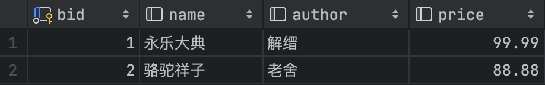

# 动态SQL

​	为了更加灵活地实现SQL命令的配置，MyBatis提供了对动态SQL语句的支持。

​	其中包括了if语句、choose语句、set语句、foreach语句实现分支与循环的逻辑控制。

## 1. if语句

​	对于一张数据表，我们可能需要有针对不同字段的查询处理



​	对于上面的表，我们如果针对每个字段都写一个SQL语句，显得很繁冗。这些命令整体差别并不大哦，于是我们可以用if语句来实现同时满足四种需要的查询语句

```xml
<select id="findByColumn" parameterType="Book" resultType="Book">
    SELECT bid, name, author, price
    FROM book
    <if test="bid != null and bid != &quot;&quot;">
        WHERE bid=#{bid}
    </if>
    <if test="name != null and name != &quot;&quot;">
        WHERE name=#{name}
    </if>
    <if test="author != null and author != &quot;&quot;">
        WHERE author=#{author}
    </if>
    <if test="price != null and price != &quot;&quot;">
        WHERE price=#{price}
    </if>
</select>
```

​	逻辑其实很简单，检查入参是否包含某个字段，包含则调用对应的查询语句


​	测试类

```java
@Test
public void testFindByColumn() throws Exception {
    Book book = new Book();
    book.setName("红高粱");
    Book res = MyBatisSessionFactory.getSession().selectOne("i.love.wsq.BookNS.findByColumn", book);
    LOGGER.info("findByColumn {}", res);

    book = new Book();
    book.setBid(2L);
    res = MyBatisSessionFactory.getSession().selectOne("i.love.wsq.BookNS.findByColumn", book);
    LOGGER.info("findByColumn {}", res);
}
```


​	从日志中可以看到对应执行的SQL语句

```sql
SELECT bid, name, author, price FROM book WHERE name=?
SELECT bid, name, author, price FROM book WHERE bid=?
```


​	插入时我们也可以用if语句，为那些空字段填写一个默认值来避免表中出现null数据（虽然更多情况下建表时就会设置默认值了）

```xml
<insert id="doCreate" parameterType="Book" keyProperty="bid" keyColumn="bid" useGeneratedKeys="true">
    INSERT INTO book(name, author, price) VALUES
    <trim prefix="(" suffix=")" suffixOverrides=",">
        <if test="name == null or name == &quot;&quot;">
            'NoName',
        </if>
        <if test="name != null and name != &quot;&quot;">
            #{name},
        </if>
        <if test="author == null or author == &quot;&quot;">
            'NoAuthor',
        </if>
        <if test="author != null and author != &quot;&quot;">
            #{author},
        </if>
        <if test="price == null or price == &quot;&quot;">
            -1,
        </if>
        <if test="price != null and price != &quot;&quot;">
            #{price},
        </if>
    </trim>
</insert>
```


## 2.choose语句

​	choose比价像是switch语句

​	下面的例子中可以看到，我们用了`<where>`，可以自动添加WHERE关键字

```xml
<select id="findByCondition" parameterType="Book" resultType="Book">
    SELECT bid, name, author, price
    FROM book
    <where>
        <choose>
            <when test="name != null and author != null">
                name=#{name} AND author=#{author}
            </when>
            <when test="name != null and author == null">
                name=#{name}
            </when>
            <when test="name == null and author != null">
                author=#{author}
            </when>
            <otherwise>
                1=1
            </otherwise>
        </choose>
    </where>
</select>
```


## 3.set语句

​	set语句针对更新不同字段的场景

```xml
<!--  MyBatis映射文件配置中insert、update、delete三个配置项的作用是相同的，随意使用  -->
<update id="doEdit" parameterType="Book">
    UPDATE book
    <set>
        <if test="name != null and name != &quot;&quot;">
            name = #{name},
        </if>
        <if test="author != null and author != &quot;&quot;">
            author = #{author},
        </if>
        <if test="price != null">
            price=#{price},
        </if>
    </set>
    <where>
        <if test="bid != null and bid != 0">
            bid=#{bid}
        </if>
        <if test="bid == null">
            bid=-1
        </if>
    </where>
</update>
```


## 4.foreach语句

foreach语句是一种具有循环结构的语句，在定义MyBatis映射文件时，可以利用该语句结合传递进来的集合类型参数进行迭代处理。有了这样的语句支持，开发者可以方便地实现指定ID范围的数据查询和数据删除操作，也可以实现数据批量增加操作。

```xml
    <sql id ="selectBook">
        SELECT bid, name, author, price
        FROM book
    </sql>
```

​	为了避免SQL语句的重复定义问题，提供了\<sql>定义标签，在使用其他语句时，可以通过\<include>标签进行内容的引用。


​	需要注意的是，在配置\<foreach>标签的collection属性时，如果配置的数据是普通的数据，可以定义为数组；如果是对象集合，则使用列表接收。程序每次迭代时会将当前数据保存在item配置的表格之中，这样就可以在SQL语句内部直接进行成员引用。

```xml
<select id="findByIds" parameterType="java.lang.Long" resultType="Book">
    <include refid="selectBook"/>
    <where>
        bid IN
        <foreach collection="array" open="(" close=")" separator="," item="bid">
            #{bid}
        </foreach>
    </where>
</select>

<select id="doRemove" parameterType="java.lang.Long">
    DELETE from book
    <where>
        bid IN
        <foreach collection="array" open="(" close=")" separator="," item="bid">
            #{bid}
        </foreach>
    </where>
</select>

<select id="doCreateBatch" parameterType="Book">
    INSERT INTO book (name, author, price) VALUES 
    <foreach collection="list" separator="," item="book">
        (#{book.name}, #{book.author}, #{book.price})
    </foreach>
</select>
```


