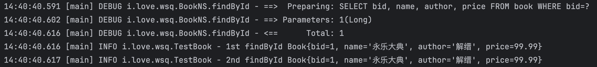
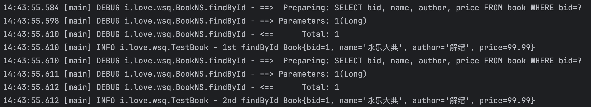
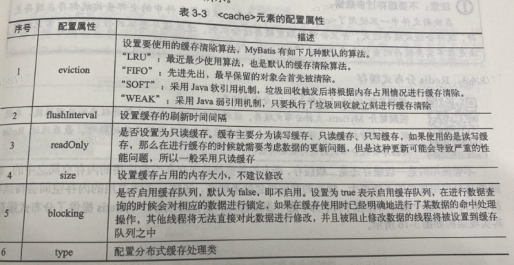

# 数据缓存

​	为了减少项目中的数据库查询压力，开发者往往会进行缓存的配置处理，MyBatis作为数据层开发组件，其本身支持缓存设计，可以提供一级缓存、二级缓存，并且可以基于Redis数据库实现二级缓存数据的存储控制。

## 1.一级缓存

​	一级缓存是MyBatis默认开启的缓存支持，在使用SqlSession接口进行指定ID数据查询时，对应的查询结果会自动保存在一级缓存之中。这样当再次进行同样ID的数据查询时，就不会重复发出查询指令，提高了对同一ID的数据查询的性能

```java
@Test
public void testCache() throws Exception {
    // 第一次查询
    Book book1 = MyBatisSessionFactory.getSession().selectOne("i.love.wsq.BookNS.findById", 1L);
    LOGGER.info("1st findById {}", book1);
    // 第二次查询
    Book book2 = MyBatisSessionFactory.getSession().selectOne("i.love.wsq.BookNS.findById", 1L);
    LOGGER.info("2nd findById {}", book2);
    MyBatisSessionFactory.close();
}
```



​	可以看到，只有第一次调用了SQL查询


​	由于一级缓存始终存在，SqlSession接口实例未关闭的情况下，可能会出现缓存和DB已经不一致的情况，这时可以使用SqlSession提供的clearCache()方法进行缓存清除。

​	我们如果在第二次查询前清除缓存

```java
MyBatisSessionFactory.getSession().clearCache();
```




## 2.二级缓存

​	一级缓存只允许当前的session实现缓存数据的处理，而二级缓存可以在多个session之间进行缓存的处理。

​	二级缓存更加符合多个线程并行访问数据的实际情况，但是二级缓存不是默认开启的，需要手动打开。

1、在核心配置文件中启用二级缓存

```xml
    <settings>
        <setting name="cacheEnabled" value="true"/>
    </settings>
```


2、修改Book.xml配置文件，在Mapper标签内启用二级缓存

```xml
<cache/>
```


3、二级缓存需要进行对象序列化处理，所以要修改Book类的定义

```java
public class Book implements Serializable
```


4、测试

```java
    @Test
    public void testCache() throws Exception {
        // 第一次查询
        SqlSession sessionA = MyBatisSessionFactory.getSessionFactory().openSession();
        Book book1 = sessionA.selectOne("i.love.wsq.BookNS.findById", 1L);
        LOGGER.info("1st findById {}", book1);
        sessionA.close();
        // 第二次查询
        SqlSession sessionB = MyBatisSessionFactory.getSessionFactory().openSession();
        Book book2 = sessionB.selectOne("i.love.wsq.BookNS.findById", 1L);
        LOGGER.info("2nd findById {}", book2);
        MyBatisSessionFactory.close();
    }
```

​	注意，二级缓存只有在session关闭的时候才会写入


​	为了避免频繁触发缓存清除机制，在不需要缓存的查询元素中定义useCache=false

```xml
    <!--  定义数据查询的操作，根据ID查询需要传递数据的主键，返回结果为VO对象实例  -->
    <select id="findById" parameterType="java.lang.Long" resultType="Book" useCache="false">
        SELECT bid, name, author, price FROM book WHERE bid=#{bid}
    </select>
```


\<cache>元素




## 3.Redis分布式缓存


先跳过


