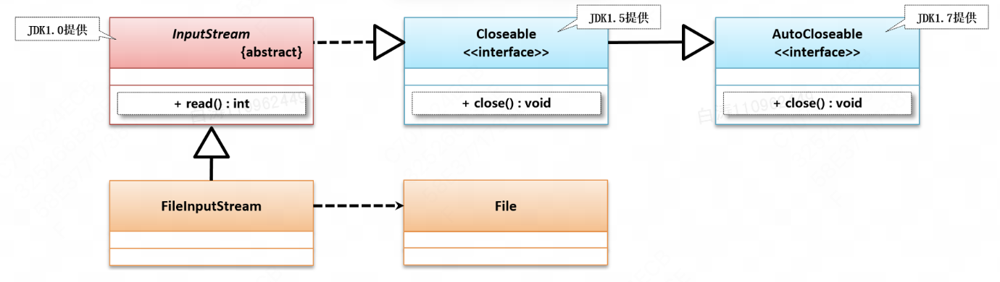

# InputStream

> ​	`java.io.InputStream`是一个**抽象类**，它是所有输入字节流的超类。
>
> ​	任何定义其子类的应用都需要提供可以返回输入流下一个字节的方法。
>
> ​														Java8 官方文档

​	官方文档给InputStream的定义就是`InputStream`是Java中对输入流的一种**规范**。不论你是文件、内存还是键盘输入，要想实现输入到内存，就必须遵照`InputStream`的规范去实现。

​	其中最重要的方法就是`read()`方法，用来源源不断的获取输入的字节。这个方法必须要由具体的子类实现，因此是一个抽象方法，所有输入流都需要实现这个方法。

## 1.`InputStream`类定义与继承结构

```java
public abstract class InputStream
extends Object
implements Closeable
```




## 2.`read`方法

```java
public abstract int read() throws IOException;
```

​	`read()`方法读取输入流的下一个字节，并返回字节表示的`int`值（0～255）。当读到末尾时，返回`-1`表示不能继续读取。

​	这个抽象方法是输入流的核心，所有InputStream流的子类都必须实现该方法，以实现输入功能。


## 3.IO异常和资源关闭

​	计算机中，类似文件、网络端口的资源都是由操作系统统一管理的。如果打开了资源没有关闭，那么就会占用内存，影响其他应用程序的运行。

​	输入流也是如此，需要我们用`close`将其释放。

​	输入流可能会发生错误，例如读取的文件不存在，没有相应权限等等。这些底层错误由Java虚拟机自动封装成`IOException`异常并抛出。异常往往使用`try catch`结构进行处理。需要注意的是，即便出现了异常，输入流也需要去被关闭，因此，我们需要用到`finally`来正确关闭输入流

```java
public void readFile() throws IOException {
    InputStream input = null;
    try {
        input = new FileInputStream("src/readme.txt");
        int n;
        while ((n = input.read()) != -1) { // 利用while同时读取并判断
            System.out.println(n);
        }
    } finally {
        if (input != null) { input.close(); }
    }
}
```


​	更加简洁的方法是`try source`结构，得益于Java 7 引入AutoCloseble接口，我们可以用编译器自动关闭资源。

```java
public void readFile() throws IOException {
    try (InputStream input = new FileInputStream("src/readme.txt")) {
        int n;
        while ((n = input.read()) != -1) {
            System.out.println(n);
        }
    } // 编译器在此自动为我们写入finally并调用close()
}
```

*备注：其实`AutoCloseable`接口的原理就是让编译器自动加上`finally`并调用`close()`*


## 4.缓冲

​	读取流的时候，一次读取一个字节并不是最高效的方法。很多流支持一次性读取多个字节到缓冲区。对于文件和网络流来说，利用缓冲区一次性读取多个字节效率往往要高很多。`InputStream`提供了两个重载方法来支持读取多个字节：

| **No.** | **方法名称**                                                 | **类型** | **描述**                                                     |
| ------- | ------------------------------------------------------------ | -------- | ------------------------------------------------------------ |
| 01      | public int **read**(byte[] b) throws  IOException            | 普通     | 将内容读取到字节数组之中，并返回读取的字节长度，如果此时已经读取到输入流底部（无数据）返回“-1” |
| 02      | public int **read**(byte[] b, int off, int  len) throws IOException | 普通     | 读取部分内容到字节数组之中，并返回读取的字节长度，若已读取到输入流底部（无数据）返回“-1”其中offset指的是b中偏移 |

​	两者都需要一个手动定义的`byte[]`数组作为缓冲区。前者是尽可能多的读取，后者是指定数目的读取。

​	两个方法的返回值不再是读入字节的`int`值，而是读取了多少个字节。如果没有数据可读则返回-1

```java
public void readFile() throws IOException {
    try (InputStream input = new FileInputStream("src/readme.txt")) {
        // 定义1000个字节大小的缓冲区:
        byte[] buffer = new byte[1000];
        int n;
        while ((n = input.read(buffer)) != -1) { // 读取到缓冲区
            System.out.println("read " + n + " bytes.");
        }
    }
}
```


*备注：其实`read()`抽象方法本身也不是一个一个读的，也是有缓冲区的。比如一次读4K字节到缓冲区，read()会在缓冲区上一个一个读。等到缓冲区读完就会触发操作系统填充缓冲区的读取*


## 5.阻塞

​	因为是同步IO，所以我们说InputStream的read()方法是阻塞的（Blocking）。

```java
int n;
n = input.read(); // 必须等待read()方法返回才能执行下一行代码
int m = n;
```

​	后面的代码必须要等read()方法返回才能继续，因此相比于普通代码，IO流会慢很多。


## 6.InpuStream实现类

​	已经反复强调了，<u>InputStream是一个抽象类，不具备有具体的实现</u>。我们需要根据子功能来为其定义子类，并实现其中的`read()`方法。以下是其实现类，其中`FileInpuStream`是文件输入流，这个会单独介绍。

​	此处我们介绍一个不常用的`ByteArrayInputStream`，它可以在内存中模拟一个InputStream，对于学习IO很有用。

[AudioInputStream](https://docs.oracle.com/javase/8/docs/api/javax/sound/sampled/AudioInputStream.html), [ByteArrayInputStream](https://docs.oracle.com/javase/8/docs/api/java/io/ByteArrayInputStream.html), [FileInputStream](https://docs.oracle.com/javase/8/docs/api/java/io/FileInputStream.html), [FilterInputStream](https://docs.oracle.com/javase/8/docs/api/java/io/FilterInputStream.html), [InputStream](https://docs.oracle.com/javase/8/docs/api/org/omg/CORBA/portable/InputStream.html), [ObjectInputStream](https://docs.oracle.com/javase/8/docs/api/java/io/ObjectInputStream.html), [PipedInputStream](https://docs.oracle.com/javase/8/docs/api/java/io/PipedInputStream.html), [SequenceInputStream](https://docs.oracle.com/javase/8/docs/api/java/io/SequenceInputStream.html), [StringBufferInputStream](https://docs.oracle.com/javase/8/docs/api/java/io/StringBufferInputStream.html)

```java
    public static void main(String[] args) {
//        File f = new File("/Users/baitao/JavaMaster/Project/JavaSE Project/io-start/src/main/resources/a.txt");
        byte[] b = new byte[]{'H', 'e', 'l', 'l', 'o'};
//        try (InputStream inputStream = new FileInputStream(f)) {
        try (InputStream inputStream = new ByteArrayInputStream(b)) {
            System.out.println(readAsString(inputStream));
        } catch (IOException e) {
            e.printStackTrace();
        }
    }

    public static String readAsString(InputStream inputStream) throws IOException {
        StringBuilder stringBuilder = new StringBuilder();
        byte[] buffer = new byte[1024];
        int len = -1;
        while ((len = inputStream.read(buffer)) != -1) {
            stringBuilder.append(new String(buffer, 0, len));
        }
        return stringBuilder.toString();
    }
```

​	这个例子分别使用文件和内存模拟作为输入流，可以看到`InputStream`作为抽象类型，可以接受各种其子类作为输入，这就是[**面向抽象编程原则**](../../3.面向对象编程/3.1 面向对象基础/3.抽象类和接口/抽象类)的应用。


