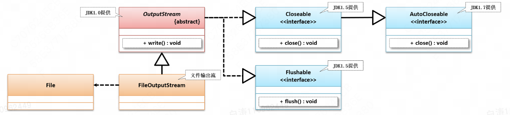

# OutputStream

> ​	`java.io.OutputStream`是一个**抽象类**，它是所有输出字节流的超类。
>
> ​	任何定义其子类的应用都需要提供可以打印输出流下一个字节的方法。
>
> ​														Java8 官方文档

​	`OutputStream`是输出字节流，是Java对于输出流的规范定义。不论什么功能想用Java实现输出流就必须遵照这个规范（用代码来说就是必须继承`OutputStream`）。

​	`OutputStream`中最核心的就是抽象方法`write()`，其功能是写一个字节到输出流。

---


## 1.`OutputStream`定义和继承结构

```java
public abstract class OutputStream 
extends Object 
implements Closeable, Flushable
```



​	除了Closeable还实现了Flushable，可以将输出流内容刷出去。


## 2.`write()`方法

```java
public abstract void write(int b) throws IOException;
```

​	虽然入参是`int`，但是由于实际上是字节输出流，所以只会取得`int`的低8位。


## 3.资源关闭


## 4.缓冲与刷新

| 序号 | 方法名称                                                     | 类型     | 功能                 |
| ---- | ------------------------------------------------------------ | -------- | -------------------- |
| 01   | public abstract void **write**(int b) throws IOException     | 普通     | 输出单个字节数据     |
| 02   | public void **write**(byte[] b) throws IOException           | 普通     | 输出一组字节数据     |
| 03   | **public void write(byte[] b, int off, int len) throws IOException** | **普通** | **输出部分字节数据** |


​	OutputStream除了实现close()方法之外，还实现了flush()方法，用于将缓冲区的内容真正输出到目的地。

​	向磁盘、网络写入数据的时候，出于效率，操作系统不会立刻把一个字节输出出去，而是放到内存的一个缓冲区（一个`byte[]`数组），等到缓冲区写满了，再一次写入文件和网络。一次写一个字节和写一千个字节，花费的时间几乎一样。

​	常规情况下，缓冲区满了会自动`flush()`，关闭`OutputStream`之前也会自动`flush()`。

​	但是，比较典型的就是，如果是一款在线聊天软件，你发一句话肯定不能等到满了再发，而是你想发送了就会立即发送。这时候就需要手动调用`flush()`方法。


## 5.阻塞

道理和InputStream一样


## 6.`OutputStream`实现类


## 7.小练习

​	掌握了io流的知识之后，尝试将一个文件复制到另一个。

```plain
java CopyFile.java source.txt copy.txt
```

​	*项目：io-copy*

