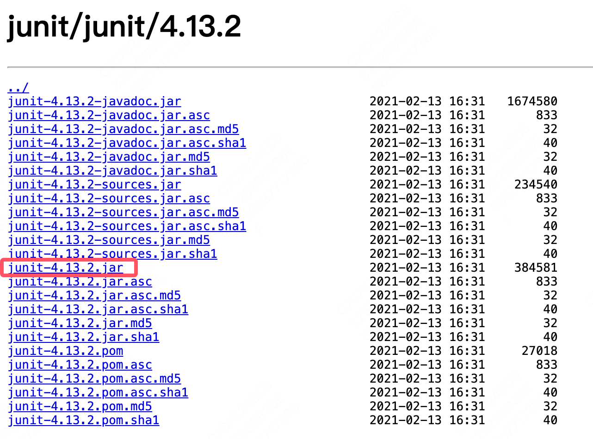
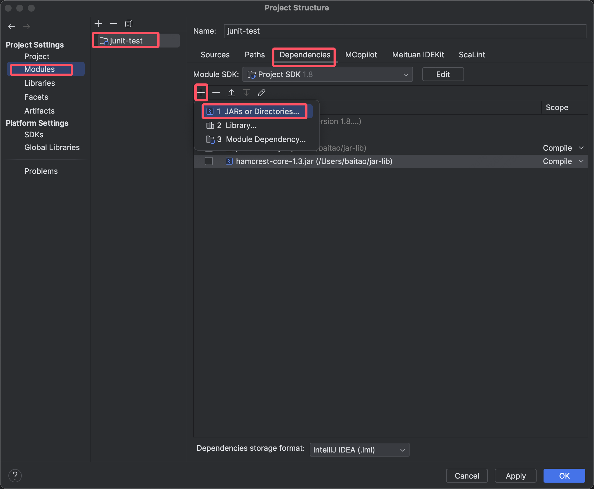
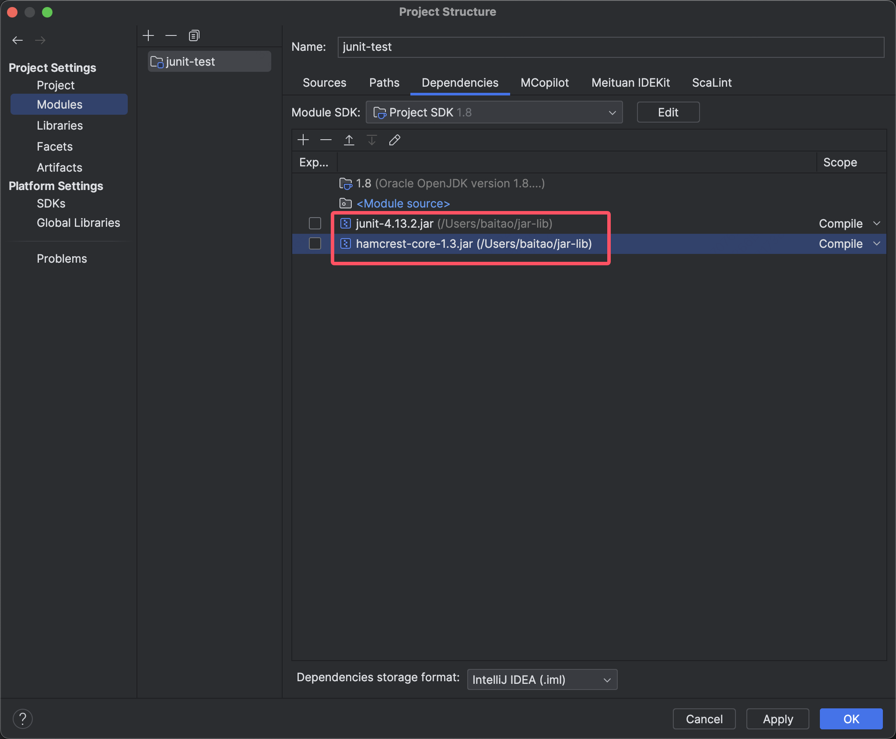

# JUnit引入

​	JUnit4官网：https://junit.org/junit4/

​	下载地址：https://github.com/junit-team/junit4/wiki/Download-and-Install

## 1.不使用Maven导入

​	如果没有使用Maven，那么需要在项目库中引入junit。

### 1.1 下载jar包

​	junit包含两个jar包

- [`junit.jar`](https://repo1.maven.org/maven2/junit/junit/4.13.2/)
- [`hamcrest-core.jar`](https://repo1.maven.org/maven2/org/hamcrest/hamcrest-core/1.3/)

​	注意要下载可执行文件，别下载成文档了




### 1.2 导入jar包

​	在项目结构中把下载的两个jar包导入即可。



​	


## 2.使用Maven

```xml
<dependency>
  <groupId>junit</groupId>
  <artifactId>junit</artifactId>
  <version>4.13</version>
  <scope>test</scope>
</dependency>
```


