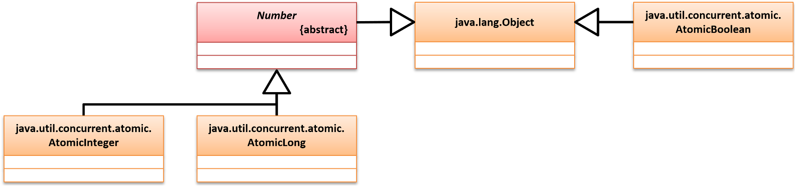
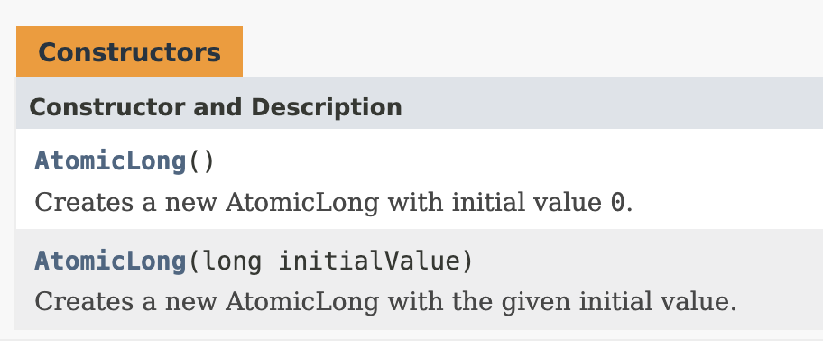

# 基础类型原子操作类

​	基本类型包括：`AtomicInteger`、`AtomicLong`、`AtomicBoolean`;


## 1.继承结构

```java
//原子整型
public class AtomicInteger
extends Number
implements Serializable
//原子长整型
public class AtomicLong
extends Number
implements Serializable
//原子布尔型
public class AtomicBoolean
extends Object
implements Serializable
```

​	其中AtomicInterger和AtomicLong都属于Number的子类，而AtomicBoolean是Object的子类




​	我们以AtomicLong为讲解


## 2.方法

### 构造方法




| **No.** | **方法**                                                     | **类型** | **描述**                                                     |
| ------- | ------------------------------------------------------------ | -------- | ------------------------------------------------------------ |
| 2       | public final long get()                                      | 普通     | 获取包装数据内容                                             |
| 3       | public final void set(long newValue)                         | 普通     | 设置新数据内容                                               |
| 4       | public final void lazySet(long  newValue)                    | 普通     | 等待当前操作线程执行完毕后再设置新内容                       |
| 5       | public final boolean  compareAndSet(long expectedValue, long newValue) | 普通     | 如果当前值等于“expectedValue”则进行设置，并返回true，如果不等则不修改并返回false |
| 6       | public final long getAndIncrement()                          | 普通     | 获取原始数据并执行数据自增                                   |
| 7       | public final long getAndDecrement()                          | 普通     | 获取原始数据并执行数据自减                                   |
| 8       | public final long incrementAndGet()                          | 普通     | 获取自增后的数据                                             |
| 9       | public final long decrementAndGet()                          | 普通     | 获取自减后的数据                                             |

​	在观察原子类操作的过程之中，会有一个CAS的方法（compareAndSet()方法），这个方法是整个JUC中实现数据同步处理而且又照顾到性能的唯一支持。

```java
public class Demo {
    public static void main(String[] args) throws InterruptedException {
        AtomicLong num = new AtomicLong();
        for (int i = 0; i < 3; i ++ ) {
            new Thread(() -> {
                System.out.printf("【%s】数据的加法运算: %d \n", Thread.currentThread().getName(), num.addAndGet(100));
            }).start();
        }
        TimeUnit.SECONDS.sleep(1);
        System.out.println("【计算完成】结果是：" + num);
    }
}
```


## 3.分析原子操作的原理

​	需要对源码进行分析


### 3.1 长整型的定义

```java
public class AtomicLong extends Number implements java.io.Serializable {
    private static final long serialVersionUID = 1927816293512124184L;
  
    private static final Unsafe unsafe = Unsafe.getUnsafe();
  
    private static final long valueOffset;
  
    static final boolean VM_SUPPORTS_LONG_CAS = VMSupportsCS8();
  
    private static native boolean VMSupportsCS8();

    static {
        try {
            valueOffset = unsafe.objectFieldOffset
                (AtomicLong.class.getDeclaredField("value"));
        } catch (Exception ex) { throw new Error(ex); }
    }

    private volatile long value;

    public AtomicLong(long initialValue) {
        value = initialValue;
    }
}

```

​	long属于64位的长度，如果运行在了32位的系统之中，那么就需要有2位去描述long数据类型，而在进行数据修改的时候必须考虑到2段的数据同时修改完成才是完成了修改


