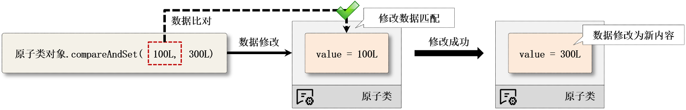
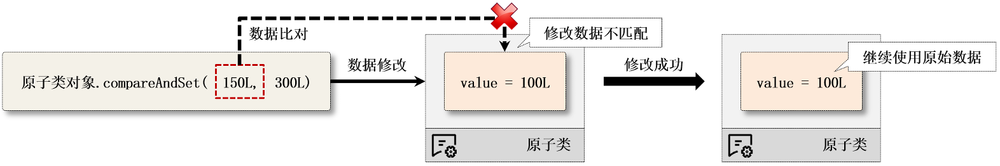

# 基础类型原子操作类

​	基本类型包括：`AtomicInteger`、`AtomicLong`、`AtomicBoolean`;


## 1.继承结构

```java
//原子整型
public class AtomicInteger
extends Number
implements Serializable
//原子长整型
public class AtomicLong
extends Number
implements Serializable
//原子布尔型
public class AtomicBoolean
extends Object
implements Serializable
```

​	其中AtomicInterger和AtomicLong都属于Number的子类，而AtomicBoolean是Object的子类


​	我们以AtomicLong为讲解


## 2.方法

### 构造方法


| **No.** | **方法**                                                     | **类型** | **描述**                                                     |
| ------- | ------------------------------------------------------------ | -------- | ------------------------------------------------------------ |
| 2       | public final long get()                                      | 普通     | 获取包装数据内容                                             |
| 3       | public final void set(long newValue)                         | 普通     | 设置新数据内容                                               |
| 4       | public final void lazySet(long  newValue)                    | 普通     | 等待当前操作线程执行完毕后再设置新内容                       |
| 5       | public final boolean  compareAndSet(long expectedValue, long newValue) | 普通     | 如果当前值等于“expectedValue”则进行设置，并返回true，如果不等则不修改并返回false |
| 6       | public final long getAndIncrement()                          | 普通     | 获取原始数据并执行数据自增                                   |
| 7       | public final long getAndDecrement()                          | 普通     | 获取原始数据并执行数据自减                                   |
| 8       | public final long incrementAndGet()                          | 普通     | 获取自增后的数据                                             |
| 9       | public final long decrementAndGet()                          | 普通     | 获取自减后的数据                                             |

​	在观察原子类操作的过程之中，会有一个CAS的方法（compareAndSet()方法），这个方法是整个JUC中实现数据同步处理而且又照顾到性能的唯一支持。

```java
public class Demo {
    public static void main(String[] args) throws InterruptedException {
        AtomicLong num = new AtomicLong();
        for (int i = 0; i < 3; i ++ ) {
            new Thread(() -> {
                System.out.printf("【%s】数据的加法运算: %d \n", Thread.currentThread().getName(), num.addAndGet(100));
            }).start();
        }
        TimeUnit.SECONDS.sleep(1);
        System.out.println("【计算完成】结果是：" + num);
    }
}
```


## 3.分析原子操作的原理

​	需要对源码进行分析


### 3.1 长整型的定义

```java
public class AtomicLong extends Number implements java.io.Serializable {
    private static final long serialVersionUID = 1927816293512124184L;
  
    private static final Unsafe unsafe = Unsafe.getUnsafe();
  
    private static final long valueOffset;
  
    static final boolean VM_SUPPORTS_LONG_CAS = VMSupportsCS8();
  
    private static native boolean VMSupportsCS8();

    static {
        try {
            valueOffset = unsafe.objectFieldOffset
                (AtomicLong.class.getDeclaredField("value"));
        } catch (Exception ex) { throw new Error(ex); }
    }

    private volatile long value;

    public AtomicLong(long initialValue) {
        value = initialValue;
    }
}

```

​	long属于64位的长度，如果运行在了32位的系统之中，那么就需要有2位去描述long数据类型，而在进行数据修改的时候必须考虑到2段的数据同时修改完成才是完成了修改


### 3.2 增加方法的实现

```java
public final long addAndGet(long delta) {
    return unsafe.getAndAddLong(this, valueOffset, delta) + delta;
}
```


### 3.3 数据增加操作依靠的是一个Unsafe类提供的处理方法

```java
public final long getAndAddLong(Object var1, long var2, long var4) {
    long var6;
    do {
        var6 = this.getLongVolatile(var1, var2);
    } while(!this.compareAndSwapLong(var1, var2, var6, var6 + var4));

    return var6;
}
```

```java
public native long getLongVolatile(Object var1, long var2);
```


​	此时的操作方法是由硬件CPU的指令完成处理的，它不再是Java的运行机制来完成的，这样的优势是在于速度快，同时又避免了数据在内存之中的互相拷贝所带来的额外开销。


### 3.4 观察CAS方法实现修改操作

```java
public class Demo {
    public static void main(String[] args) throws InterruptedException {
        AtomicLong num = new AtomicLong(100L);
        System.out.println("【原子数据修改】数据修改的结果：" +  num.compareAndSet(200L, 300L));
        System.out.println("数据内容：" + num.get());
        System.out.println("【原子数据修改】数据修改的结果：" +  num.compareAndSet(100L, 300L));
        System.out.println("数据内容：" + num.get());
    }
}
```

​	只有在CAS操作不叫成功之后才会进行内容的修改，而如果此时比较失败不会进行内容修改，这是一种**乐观锁**的机制。

​	**乐观锁**指的是一半不会发生任何的问题，也不需要进行非常严格的处理。悲观锁就是依靠synchronized同步实现的，因为认为总是会有问题产生

#### 1.正确的数据修改操作：




#### 2.错误的数据修改操作



​	乐观锁的底层也是compareAndSwap()方法，所以其实也是CPU指令实现的。

​	

## 高性能CAS处理机制

​	`compareAndSet()`数据修改操作方法在J.U.C中被称为**CAS机制**，**CAS（Compare-And-Swap）是一条CPU并发原语**。它的功能是判断内存某个位置的值是否为预期值，如果是则更改为新的值，反之则不进行修改，这个过程属于原子性操作。


​	在多线程进行数据修改时，为了保证数据修改的正确性，常规的做法就是使用`synchronized`同步锁，但是这种锁属于“**悲观锁（Pessimistic Lock）**”，每一个线程都需要在操作之前锁定当前的内存区域，而后才可以进行处理，这样一来在高并发环境下就会严重影响到程序的处理性能。


​	而CAS采用的是一种“乐观锁”（Optimistic Lock）机制，其最大的操作特点是不进行强制性的同步处理（没有synchronized），而为了保证数据修改的正确性，添加了一些比较的数据（例如：compareAndSet()在修改之前需要进行数据的比较），采用的是一种冲突重试的处理机制，这样可以有效的**避免线程阻塞**问题的出现。在并发竞争不是很激烈的情况下，可以获得较好的处理性能，而在<u>JDK 1.9后为了进一步提升CAS的操作性能</u>，又追加了硬件处理指令集的支持，可以充分的发挥服务器硬件配置的优势，得到更好的处理性能。

