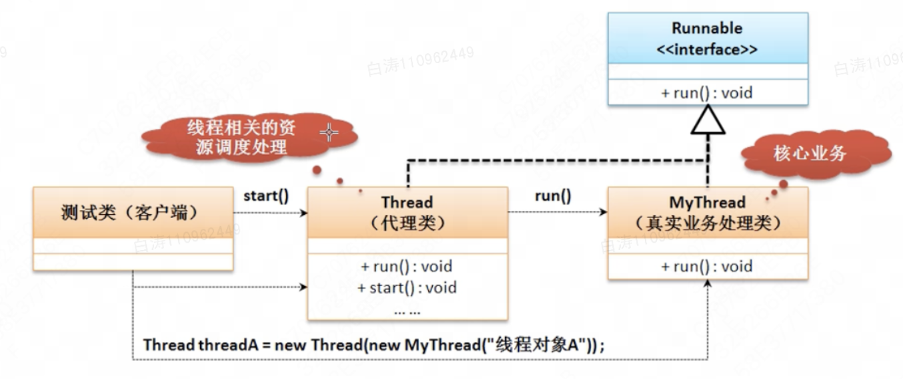
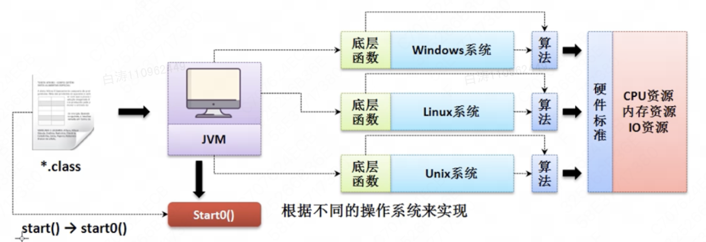

# 多线程编程

*项目：thread-multi*

​	Java语言内置了多线程支持。当Java程序启动的时候，实际上是启动了一个JVM进程，然后，JVM启动主线程来执行`main()`方法。

​	要想实现新的线程，那么就需要有一个专门的线程主体类进行线程执行任务的定义。这个线程主体类的定义有要求——必须要实现继承特定的父类或者实现特定的接口。

## 1.`Thread`类

​	`java.lang.Thread`类，是JDK 1.0提供的用来实现多线程主体类的类，其定义如下：

```java
public class Thread
extends Object
implements Runnable
```


​	Thread类中有一个关键的抽象方法`run()`，这个方法定义了新线程的执行过程。

```java
public abstract void run();
```


​	创建新线程需要如下工作：

1. 继承`Thread`类；
2. 覆写`run()`方法；
3. 使用`start()`方法启动新线程。

***强调：不能用`run()`方法启动，`run()`也启动不了，只会顺序执行***

```java
public class Main {
    public static void main(String[] args) {
        Thread t = new MyThread();
        t.start();
    }
}

class MyThread extends Thread {
    @Override
    public void run() {
        System.out.println("开始了新线程");
    }
}
```


​	为什么必须使用start()方法启动新线程，请看专门的分析。

​	`Thread`类是一个很优美的代理设计模式的体现，在学习代理设计模式的时候不妨回头看看Thread类的实现。


## 2.`Runnable`接口

​	上面我们说到，`Thread()`方法中的关键就是抽象方法`run()`。实际上该方法是从`Runnable`接口处获得的。

​	`Runnable`接口是一个典型的函数式接口。`Thread`对于`Runnable`可以理解为一种**代理设计模式**。

```java
@FunctionalInterface
public interface Runnable {
    public abstract void run();
}
```




​	换句话说，其实我们只需要哦实现`Runnable`接口就可以创建新的线程。<u>而`Thread`的构造方法也提供了将`Runnable`接口作为参数的构造方法</u>。

​	用`Runnable`接口创建新线程需要如下工作：

1. 实现`Runnable`接口；
2. 覆写`run()`方法；
3. 使用`start()`方法启动新线程。

```java
public class Main {
    public static void main(String[] args) {
        Thread t = new Thread(new MyRunnable());
        t.start();
    }
}

class MyRunnable implements Runnable {
    @Override
    public void run() {
        System.out.println("利用Runnable开始新线程");
    }
}
```


​	由于Runnable是函数式接口，可以使用lambda表达式

```java
public class Main {
    public static void main(String[] args) {
        Thread t = new Thread(() -> {
            System.out.println("利用Runnable开始新线程");
        });
        t.start();
    }
}
```


​	本质上还是使用Thread类完成了多线程，其实没太大区别。


## 3.观察多线程

​	实现了多线程以后，我们可以观察多线程的执行特点。

```java
public class Main {
    public static void main(String[] args) {
        System.out.println("【主线程】嘟嘟");
        Thread t = new Thread(() -> {
           System.out.println("【子线程】地地地道道");
           System.out.println("【子线程】地道道地道");
        });
      	t.start();
        System.out.println("【主线程】请让一让");
    }
}
```

​	分析这个程序执行：

1. 打印*"【主线程】嘟嘟"*
2. 创建并运行子线程，此时子线程和*"【主线程】请让一让"*会并发执行。

​	按例来说，最后一个打印会出现在子线程的两个打印前中后任意位置。但是我的电脑上永远都是在前，这是因为现在的CPU太快了，打印不可能比创建线程慢。


​	话虽如此，我们可以使用`Thread.sleep()`强迫线程暂停，来模拟主线程慢于子线程。静态方法`Thread.sleep()`会让正在运行的线程“睡觉”，这样就会使得线程可能在这段时间内切换到另一个线程执行，模拟出执行时间长的线程。

```java
public class Main {
    public static void main(String[] args) {
        System.out.println("【主线程】嘟嘟");
        Thread t = new Thread(() -> {
           System.out.println("【子线程】地地地道道");
            try {
                Thread.sleep(10);
            } catch (InterruptedException e) {
                throw new RuntimeException(e);
            }
            System.out.println("【子线程】地道道地道");
        });
        t.start();
        try {
            Thread.sleep(20);
        } catch (InterruptedException e) {
            throw new RuntimeException(e);
        }
        System.out.println("【主线程】请让一让");
    }
}

```


## 4.start()方法

 	为什么不用`run()`方法而是用`start()`方法，可以看看start()方法的具体定义

```java
public synchronized void start() {
        if (threadStatus != 0)//判断线程的状态
            throw new IllegalThreadStateException();//抛出了一个异常

        group.add(this);

        boolean started = false;
        try {
            start0();//在start中调用了start0
            started = true;
        } finally {
            try {
                if (!started) {
                    group.threadStartFailed(this);
                }
            } catch (Throwable ignore) {
            }
        }
    }
```

​        start()方法里面跑出了`IllegalThreadStateException`异常，但是因为它是`RuntimeException`的子类所以可以不用处理。它的含义是每一个线程类的对象只允许启动一次，如果重复启动则抛出异常。

​        在Java程序执行的过程之中考虑到对于不同层次开发者的需求，所以其支持有本地的操作系统函数调用，而这项技术被称为**JNI技术（Java Native InterfaceInterface）**，但是Java的开发过程之中不推荐这样使用。利用这项技术可以使用一些操作系统提供的底层函数进行一些特殊的处理，而在`Thread`类里面提供的`start0()`就表示需要此方法依赖于不同的操作系统实现。换句话说就是为了可移植性。

​        `start0()`在Thread中其实没有实现，JVM会依据不同的操作系统进行覆写。




## 5.线程的状态

​	Java程序中，一个线程对象只能调用一次start()方法启动新线程，并在新线程中执行`run()`方法。一旦`run()`方法执行完毕，线程就结束了。因此，Java线程状态有以下几种：


```
         ┌─────────────┐
         │     New     │
         └─────────────┘
                │
                ▼
┌ ─ ─ ─ ─ ─ ─ ─ ─ ─ ─ ─ ─ ─ ─ ─ ┐
 ┌─────────────┐ ┌─────────────┐
││  Runnable   │ │   Blocked   ││
 └─────────────┘ └─────────────┘
│┌─────────────┐ ┌─────────────┐│
 │   Waiting   │ │Timed Waiting│
│└─────────────┘ └─────────────┘│
 ─ ─ ─ ─ ─ ─ ─ ─ ─ ─ ─ ─ ─ ─ ─ ─
                │
                ▼
         ┌─────────────┐
         │ Terminated  │
         └─────────────┘
```


## 6.线程的优先级

可以对线程设定优先级，设定优先级的方法是：

```java
Thread.setPriority(int n) // 1~10, 默认值5
```

​	JVM自动把1（低）~10（高）的优先级映射到操作系统实际优先级上（不同操作系统有不同的优先级数量）。优先级高的线程被操作系统调度的优先级较高，操作系统对高优先级线程可能调度更频繁，但我们决不能通过设置优先级来确保高优先级的线程一定会先执行


