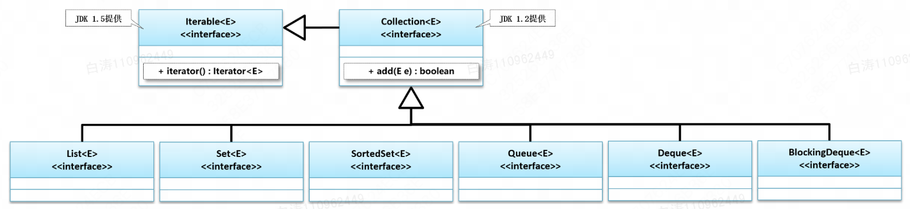

# 集合

​	Collcetion，中文中的集合。集合就是“**由若干确定元素所构成的整体**”。例如，廖雪峰老师给出的五只小兔的集合（太可爱了忍不住copy下来了）：

```
┌ ─ ─ ─ ─ ─ ─ ─ ─ ─ ─ ─ ─ ─ ─ ─ ─ ─ ─ ─ ─ ─ ─ ─ ─ ─ ┐

│   (\_(\     (\_/)     (\_/)     (\_/)      (\(\   │
    ( -.-)    (•.•)     (>.<)     (^.^)     (='.')
│  C(")_(")  (")_(")   (")_(")   (")_(")   O(_")")  │

└ ─ ─ ─ ─ ─ ─ ─ ─ ─ ─ ─ ─ ─ ─ ─ ─ ─ ─ ─ ─ ─ ─ ─ ─ ─ ┘
```


​	Java中的集合可以这样定义：一个Java对象可以在内部持有若干其他Java对象，并对外提供访问接口，则这种对象称为集合。（这里就不强调数学里的唯一性，无序性啥的了，毕竟我们使用也不是完全对标数学）

​	最简单的，数组就是一种集合。


​	由于数组限制太多，JDK1.2开始Java引入了集合类`Collection`


## Collection

​	`java.util.Collection`，它是除了`Map`外所有集合类的根接口。

​	java.util主要包含了以下三种类型的集合：

- `List`：有序列表
- `Set`：无重复集合
- `Map`：键值对集合


​	Java集合设计时有如下特点：

- 接口和实现类相分离；
- 支持泛型
- 遍历集合利用迭代器。


​       集合从JDK1.2开始，最初的类集实现由于Java本身的技术所限，所以对于数据的控制并不严格，全部采用了Object类型进行接收。

​	在JDK1.5之后由于泛型技术的推广，所以类集本身也得到了良好的改进，可以直接利用泛型来保存相同类型的数据，并且随着数据量的不断增加。

​	从JDK1.8开始类集中的实现算法也得到了性能上的良好提升。


​	由于年代久远，集合中的一些类已经不建议使用：

- `Hashtable`：一种线程安全的`Map`实现；
- `Vector`：一种线程安全的`List`实现；
- `Stack`：基于`Vector`实现的`LIFO`的栈。

还有一小部分接口是遗留接口，也不应该继续使用：

- `Enumeration<E>`：已被`Iterator<E>`取代


## 为什么设计集合

​        从JDK1.2开始Java引入了类集开发框架，所谓的类集指的就是一套动态对象数组的实现方案，在实际的开发之中，没有任何一项的开发可以离开数组，但是传统的数组实现起来非常的繁琐，而且长度是其致命伤，因此它不可能大范围使用，但是开发是不可能离开数组的，所以最初就只能依靠一些数据结构来实现动态的数组处理，而其中最为重要的两个结构：链表、树，但是面对这些数据结构的实现又不得不面对如下的问题：

- 数据结构的代码实现困难，对于一般的开发者是无法进行使用的；
- 对于链表和二叉树，更新处理和维护非常麻烦；
- 对于链表或二叉树还需要尽可能保证其操作的性能。

 

​        在整个类集框架中主要有如下核心框架：Collection、List、Set、Map、Iterator、Enumeration、Queue、ListIterator 


数组：

- 索引查询O(1)，按内容查找O(n)，优化二分为O(log2n)；
- 开发难度相对低


链表：

- 查询性能为O(n)，如果要想针对于链表进行优化，那么也一定需要排序，而后利用跳表结构；
- 链表的开发难度较高，而且要想开发出一套稳定的链表需要长期的不断维护；
- 在进行链表开发的时候还需要靠路到多线程的同步处理问题，以及出现不同步时的错误响应。


红黑树：

- 红黑树是对链表数据结构的优化，在查询上有明显的性能优势；
- 红黑树的开发难度更是高，相关维护操作例如其插入和删除实现难度都不低；


# 5.2 Collection接口简介

​        java.util.Collection是**单值集合操作**的最大的父接口，在该接口之中定义有所有的单值数据的处理操作，这个接口之中定义有如下的核心操作方法：

| No.    | 方法名称                                 | 类型     |                                         |
| ------ | ---------------------------------------- | -------- | --------------------------------------- |
| **01** | **public boolean add(E e)**              | **普通** | **向集合保存**                          |
| 02     | public addAll(Collection<? extends E> c) | 普通     | 追加一组数据                            |
| 03     | public void clear()                      | 普通     | 根结点为空，同时其他节点做GC处理        |
| 04     | public boolean contains(Object o)        | 普通     | 查询数据是否存在，需要equals()支持      |
| 05     | public boolean remove(Object o)          | 普通     | 数据删除，需要equals()方法支持          |
| 06     | public int size()                        | 普通     | 获取数据长度，不能超过Integer.MAX_VALUE |
| 07     | public Object[] toArray()                | 普通     | 将集合变为对象数组使用返回              |
| **08** | **public Iteraror<E> iterator()**        | **普通** | **将集合变为Iterator接口返回**          |

​        进行集合处理时，最常用的就是【数据增加】add()、【输出】iterator()。

​        在JDK1.5之前，Collection只是一个独立的接口，从JDK1.5之后提供了Iterable父接口，并且在JDK1.8的之后针对于Iterable接口做出了扩充。

​        在JDK1.5之后，更多使用的Collection的子接口List和Set，而不使用原本的Collection。

早期开发的时候还会直接使用Collection接口，现如今Collection接口已经不能够准确描述其存储数据的特点，所以已经不再适合现代开发。现代开发中我们**更多使用Collection的子接口**，所以掌握每一个子接口的存储特点和相关子类使用方法才是类集中最重要的部分

**Collection接口继承了Iterable接口，因此其子接口都可以实现迭代器输出**。

