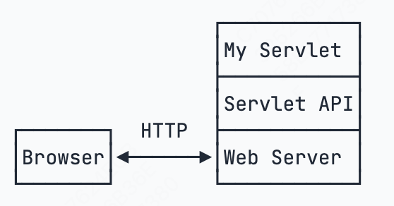

# Servlet入门

​	编写HTTP服务器本身其实不难，只需要编写基于多线程的TCP服务，然后在一个TCP连接中读取HTTP请求，发送HTTP响应。但是，要编写一个完善的HTTP服务器，需要考虑的就很多了。

- 识别正确和错误的HTTP请求；
- 识别正确和错误的HTTP头；
- 复用TCP连接；
- 复用线程；
- IO异常处理；

​	这些基础工作耗费大量时间，并且经过长期测试才能稳定运行。如果我们只是输出一个简单的HTML页面，就得编写上千行底层代码，那显然无法高效而可靠地开发。


​	因此，在JavaEE平台上，处理TCP连接，解析HTTP协议这些底层工作统统扔给现成的Web服务器去做，我们只需要把自己的应用程序跑在Web服务器上。为了实现这一目的，JavaEE提供了Servlet API，我们使用Servlet API编写自己的Servlet来处理HTTP请求，Web服务器实现Servlet API接口，实现底层功能：




## 1.引入依赖

​        由于我使用的是Java8，因此只能使用4.0版本的，如果是5.0版本的话由于维护者更换名字是变了的

```xml
<dependency>
        <groupId>javax.servlet</groupId>
        <artifactId>javax.servlet-api</artifactId>
        <version>4.0.1</version>
        <scope>provided</scope>
</dependency>
```

​        scope是provided表示编译时使用，但我们不打包到.war文件中，因为Web服务器本身是会提供Servlet API的jar包的。

​	war表示Java Web Application Archive

​        为了方便我们指定包名称为hello

```xml
<build>
        <finalName>hello</finalName>
</build>
```


### 版本命名变动

​	要务必注意`servlet-api`的版本。4.0及之前的`servlet-api`由Oracle官方维护，引入的依赖项是`javax.servlet:javax.servlet-api`，编写代码时引入的包名为：

```java
import javax.servlet.*;
```

​	而5.0及以后的`servlet-api`由Eclipse开源社区维护，引入的依赖项是`jakarta.servlet:jakarta.servlet-api`，编写代码时引入的包名为：

```java
import jakarta.servlet.*;
```

​	Spring 5 只能使用`javax.servlet:4.0.0`版本，这一点针对不同项目要特别注意。


### 工程结构

​	Web应用工程结构如下：

```
web-servlet-hello/
├── pom.xml
└── src/
    └── main/
        ├── java/
        │   └── com/
        │       └── itranswarp/
        │           └── learnjava/
        │               └── servlet/
        │                   └── HelloServlet.java
        ├── resources/
        └── webapp/
```

​	webapp用来放置一些web相关的文件，如HTML和jsp文件。注意：webapp目录下需要放`/WEB-INF/web.xml`文件，这是低版本Servlet必须的。


## 2.实现简单的Servlet

​        Servlet方法总是继承自HttpServlet，覆写其doGet()和doPost()方法。

​        doGet()方法传入了HttpServletRequest和HttpServletResponse两个对象，分别表示HTTP请求和HTTP响应。我们使用Servlet API时，并不直接与底层TCP交互，也不需要解析HTTP协议，因为它们已经封装好了请求和响应。

```java
// WebServlet注解表示这是一个Servlet，并映射到地址/:
@WebServlet(urlPatterns = "/")
public class HelloServlet extends HttpServlet {
    protected void doGet(HttpServletRequest req, HttpServletResponse resp) throws ServletException, IOException {
        // 设置响应类型:
        resp.setContentType("text/html");
        // 获取输出流:
        PrintWriter pw = resp.getWriter();
        // 写入响应:
        pw.write("<h1>Hello, world!</h1>");
        // 最后不要忘记flush强制输出:
        pw.flush();
    }
}
```

​        可以看到我们没有自己去构建响应信息，而是借由HttpServletResponse实现了响应信息的构建。


## 3.运行Web应用

​	执行package就能在target目录下得到.war文件，也就是打包后的Web应用程序。

​	普通的Java程序通过启动JVM，然后执行main()方法开始运行；

​        普通的Java程序通过启动JVM，执行main()方法开始运行。但是Web应用程序不同，我们必须先启动Web服务器，再由Web服务器加载我们编写的HelloServlet，才可以让它处理浏览器发送的请求。

​        常见的支持的Servlet API的Web服务器：

- Tomcat：由Apache开发的开源免费服务器；

- Jetty：由Eclipse开发的开源免费服务器；

- GlassFish：一个开源的全功能JavaEE服务器。
- Oracle的[WebLogic](https://www.oracle.com/middleware/weblogic/)。收费
- IBM的[WebSphere](https://www.ibm.com/cloud/websphere-application-platform/)。收费

​        我们选用开源免费的Tomcat服务器。


​        在浏览器输入http://localhost:8080/hello/即可看到HelloServlet的输出：

​        为啥路径是/hello/而不是/？因为一个Web服务器允许同时运行多个Web App，而我们的Web App叫hello，因此，第一级目录/hello表示Web App的名字，后面的/才是我们在HelloServlet中映射的路径。