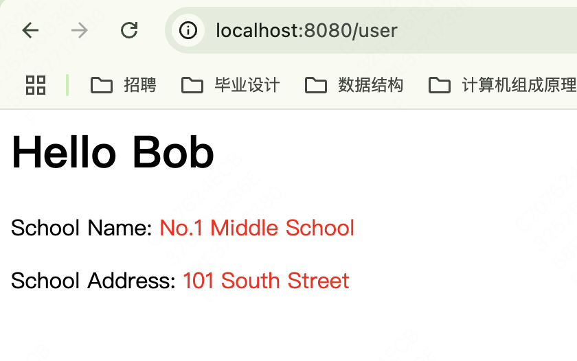

# MVC开发

- Servlet适合编写Java代码，实现各种复杂的业务逻辑，但不适合输出复杂的HTML
- JSP适合编写HTML，并在其中插入动态内容，但不适合编写复杂的Java代码。

​	如果将二者结合起来，就可以扬长避短。


## JavaBean

```java
public class User {
    public long id;
    public String name;
    public School school;
}

public class School {
    public String name;
    public String address;
}
```


# Servlet

​	假装从DB读取信息，然后将信息放到Request，交由jsp文件处理

```java
@WebServlet(urlPatterns = "/")
public class UserServlet extends HttpServlet {
    @Override
    protected void doGet(HttpServletRequest req, HttpServletResponse resp) throws ServletException, IOException {
        // 假装是从数据库读的
        School school = new School("No.1 Middle School", "101 South Street");
        User user = new User(123, "Bob", school);
        // 放到Request中
        req.setAttribute("user", user);
        req.getRequestDispatcher("/WEB-INF/user.jsp").forward(req, resp);
    }
}
```

​	


## JSP

​	在JSP文件中我们展示JavaBean的信息

```jsp
<%@ page contentType="text/html;charset=UTF-8" language="java" %>
<%@ page import="com.i.love.wsq.bean.*" %>
<%
    User user = (User) request.getAttribute("user");
%>
<html>
<head>
    <title>Hello World-JSP</title>
</head>
<body>
    <h1>Hello <%=user.name%></h1>
    <p>School Name:
        <span style="color:red">
        <%= user.school.name %>
    </span>
    </p>
    <p>School Address:
        <span style="color:red">
        <%= user.school.address %>
    </span>
    </p>
</body>
</html>

```





## MVC模式

​	我们把UserServlet看作业务逻辑处理，把User看作模型，把user.jsp看作渲染，这种设计模式常被称为MVC：Model-View-Controller，即UserServlet作为控制器，User作为模型，user.jsp看作视图，框架如下

```
                   ┌───────────────────────┐
             ┌────▶│Controller: UserServlet│
             │     └───────────────────────┘
             │                 │
┌───────┐    │           ┌─────┴─────┐
│Browser│────┘           │Model: User│
│       │◀───┐           └─────┬─────┘
└───────┘    │                 │
             │                 ▼
             │     ┌───────────────────────┐
             └─────│    View: user.jsp     │
                   └───────────────────────┘
```

使用MVC模式的好处是，Controller专注于业务处理，它的处理结果就是Model。Model可以是一个JavaBean，也可以是一个包含多个对象的Map，Controller只负责把Model传递给View，View只负责把Model给“渲染”出来，这样，三者职责明确，且开发更简单，因为开发Controller时无需关注页面，开发View时无需关心如何创建Model。

MVC模式广泛地应用在Web页面和传统的桌面程序中，我们在这里通过Servlet和JSP实现了一个简单的MVC模型，但它还不够简洁和灵活，后续我们会介绍更简单的Spring MVC开发。