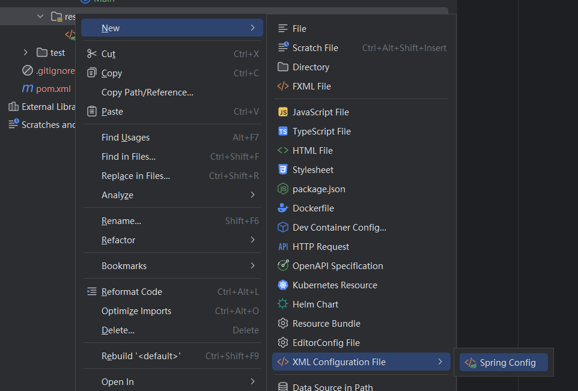
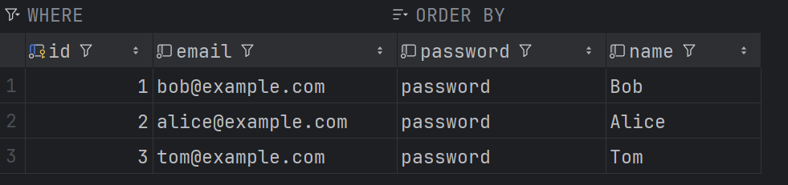

# 装配Bean

​	接下来我们通过一个**用户注册登录**的例子来看看怎么使用IoC容器，容器装配的Bean怎么使用？

```
spring-ioc-appcontext
├── pom.xml
└── src
    └── main
        ├── java
        │   └── com
        │       └── itranswarp
        │           └── learnjava
        │               ├── Main.java
        │               └── service
        │                   ├── MailService.java
        │                   ├── User.java
        │                   └── UserService.java
        └── resources
            └── application.xml
```


​	依赖：

```xml
<dependency>
    <groupId>org.springframework</groupId>
    <artifactId>spring-context</artifactId>
    <version>5.2.6.RELEASE</version>
</dependency>
```


## 1.编写服务

MailService：用于在用户登录和注册成功后发送邮件通知

UserService：用于处理用户的登录和注册

User：用户类


## 2.配置文件

​	我们需要编写application.xml配置文件，告诉Spring的IoC容器如何创建并组装bean：

​	在Resource中 创建



​	因为我们只有这两个bean，User是一个简单Java类，不是组件

```xml
    <bean id="userService" class="com.ILoveWsq.service.UserService">
        <property name="mailService" ref="mailService"/>
    </bean>

    <bean id="mailService" class="com.ILoveWsq.service.MailService"/>
```

​	id代表Bean的唯一标识，class自然是Bean的类名

​	property用来注入，其中name是这个Bean类中注入到对象的名字（代码里那个），ref是注入的实例的id（xml文件里的）

​	Bean的顺序不重要，可以自动正确初始化。Spring容器读取xml文件后用反射完成。


​	如果还不明白的话，把这个配置翻译成Java就是这样的

```java
UserService userService = new UserService();
MailService mailService = new MailService();
userService.setMailService(mailService);
```


### 2.1 注入原始数据类型


## 3.创建Spring的IoC容器

​	最后我们只需要创建容器，加载配置。只需要一行代码：

```java
    ApplicationContext applicationContext = new ClassPathXmlApplicationContext("application.xml");
```

​	ApplicationContext接口有很多实现类，这里我们选择的是从classpath中查找xml配置文件的实现类。

​	ApplicationContext接口的实现就是我们的Spring容器，我们可以用容器直接获得Bean

```java
    UserService userService = context.getBean(UserService.class);
```


### 3.1 BeanFactory

Spring还提供另一种IoC容器叫`BeanFactory`，使用方式和`ApplicationContext`类似：

```java
BeanFactory factory = new XmlBeanFactory(new ClassPathResource("application.xml"));
MailService mailService = factory.getBean(MailService.class);
```

`BeanFactory`和`ApplicationContext`的区别在于，`BeanFactory`的实现是按需创建，即第一次获取Bean时才创建这个Bean，而`ApplicationContext`会一次性创建所有的Bean。实际上，`ApplicationContext`接口是从`BeanFactory`接口继承而来的，并且，`ApplicationContext`提供了一些额外的功能，包括国际化支持、事件和通知机制等。通常情况下，我们总是使用`ApplicationContext`，很少会考虑使用`BeanFactory`。


## 4.编写测试类

​	既然注入完了我们自然要检查一下是不是成功了，我们试试登录功能和注册功能

```java
public static void main(String[] args) {
        Scanner scan = new Scanner(System.in);
        System.out.println("请输入你的想要完成的功能：");
        System.out.println("1:登录");
        System.out.println("2:注册");
        System.out.println("3:退出");
        while (scan.hasNext()) {
            String input = scan.nextLine();
            if (input.equals("1")) {
                System.out.println("请输入邮箱:");
                String email = scan.nextLine();
                System.out.println("请输入密码:");
                String password = scan.nextLine();
                userService.login(email, password);
            }
            if (input.equals("2")) {
                System.out.println("请输入邮箱:");
                String email = scan.nextLine();
                System.out.println("请输入密码:");
                String password = scan.nextLine();
                System.out.println("请输入昵称:");
                String name = scan.nextLine();
                userService.register(email, password, name);
            }
            if (input.equals("3")) {
                System.out.println("拜拜~");
                return;
            }
        }
    }
```

执行效果：

```
请输入你的想要完成的功能：
1:登录
2:注册
3:退出
2
请输入邮箱:
baitao@qq.com
请输入密码:
123456
请输入昵称:
bt
Welcome, bt!
1
请输入邮箱:
baitao@qq.com
请输入密码:
123456
Hi, bt! You have logged in at 2024-11-24 15:28:33
3
拜拜~
```


## 5.课后练习

​	结合JDBC，做成通过数据库检查用户

​	原理就是我们把DataSource注入到UserService


### 引入依赖

```xml
       <dependency>
            <groupId>mysql</groupId>
            <artifactId>mysql-connector-java</artifactId>
            <version>5.1.47</version>
            <scope>runtime</scope>
        </dependency>

        <dependency>
            <groupId>com.zaxxer</groupId>
            <artifactId>HikariCP</artifactId>
            <version>2.7.1</version>
        </dependency>
```


### 建表




### 注入

如果注入的不是Bean，而是`boolean`、`int`、`String`这样的数据类型，则通过`value`注入，例如，创建一个`HikariDataSource`：

```xml
    <bean id="dataSource" class="com.zaxxer.hikari.HikariDataSource">
        <property name="jdbcUrl" value="jdbc:mysql://localhost:3306/springDB?autoReconnect=true&amp;useSSL=false" />
        <property name="username" value="springUser" />
        <property name="password" value="password" />
        <property name="maximumPoolSize" value="10" />
        <property name="autoCommit" value="true" />
    </bean>
```

​	其实这里可以说道说道，实际上HikariDataSource是继承了HikariConfig的，因此直接设置HikariData

Source的这些元素也是ok的，之前我们是为了好看所以先做了HikariConfig然后构造了HikariDataSource，因为现在是注入，我们就没必要先弄一个config再注入到DataSource里了（实际上也不行，因为HikariDataSource里没有HikariConfig，人俩是继承不是注入）

​	mysql现在要求必须设置useSSL，不然会有很多警告信息干扰


### 修改代码

​	主要是UserService的注册和登录需要修改


