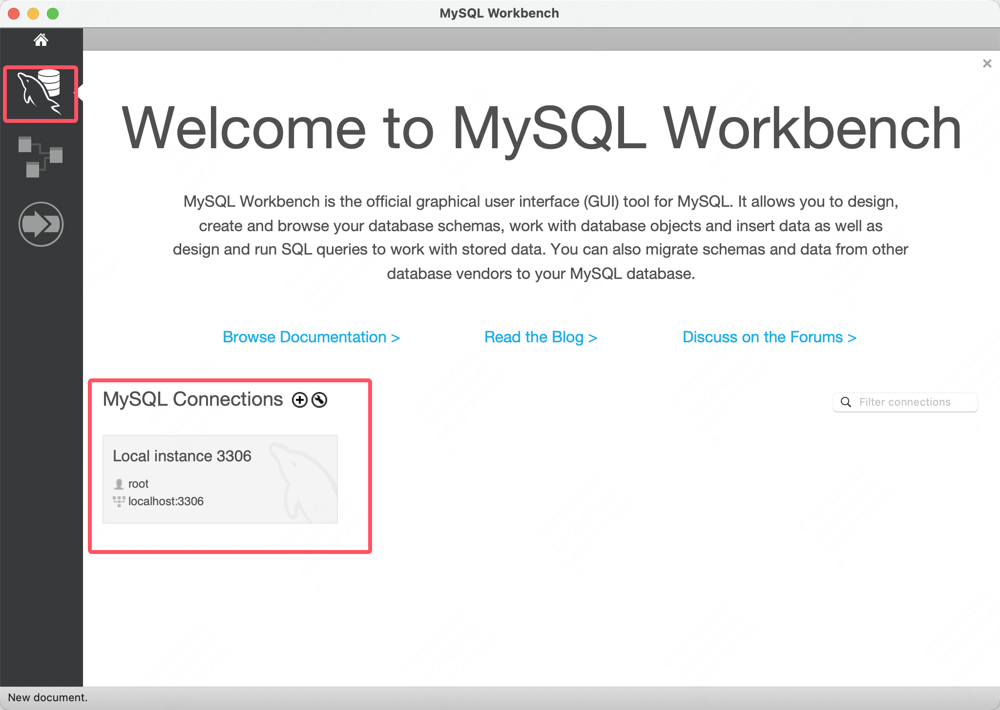

1.安装网址：https://dev.mysql.com/downloads/mysql/

在这里选择版本

tar是打包

tar.gz是打包了并压缩了

设置根密码

使用`mysql -uroot -p`进入数据库

-u后紧挨着用户名

-p后紧挨着密码（也可以不写，之后单独输入）

`mysql --verion`查看本地安装的版本，检查是否安装成功

## MySQL workbench

安装可视化工具https://dev.mysql.com/downloads/workbench/

直接链接本地的数据库即可

## MySQL源码下载

在下载页面选择source code

据说读源码还是很有意思的，有时间可以看看

## MySQL官方论坛

https://forums.mysql.com/
