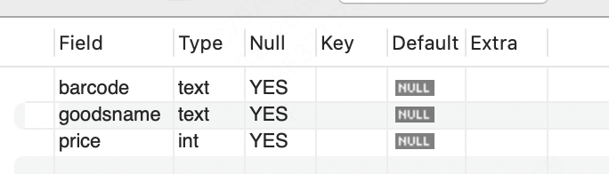
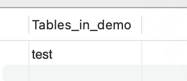

# 存储

创建数据库、确认字段、创建数据表、插入数据


## 创建数据库

`CREATE DATABASE xxxx`


`SHOW DATABASES`查看所有数据库

（old school的话会显示这样）

```
mysql> show databases;
+--------------------+
| Database           |
+--------------------+
| demo               |
| information_schema |
| mysql              |
| performance_schema |
| sys                |
+--------------------+
5 rows in set (0.00 sec)
```


- demo是我新创建的，也就是用户使用的

- “information_schema”是MySQL系统自带的数据库，主要保存MySQL数据库服务器的系统信息，比如数据库的名称、数据表的名称、字段名称、存取权限、数据文件所在的文件夹和系统使用的文件夹，等等。
- “performance_schema”是MySQL系统自带的数据库，可以用来监控MySQL的各类性能指标。
- “sys”数据库是MySQL系统自带的数据库，主要作用是，以一种更容易被理解的方式展示MySQL数据库服务器的各类性能指标，帮助系统管理员和开发人员监控MySQL的技术性能。
- “mysql”数据库保存了MySQL数据库服务器运行时需要的系统信息，比如数据文件夹、当前使用的字符集、约束检查信息，等等

如果是DBA，那么你就会需要相关信息了


## 创建数据表

```
CREATE TABLE demo.test
( 
  barcode text,
  goodsname text,
  price int
); 
```


查看表结构：`DESCRIBE xxxx`




切换数据库，产看表

use demo;
show tables;




## 主键

给我们的表加个主键

```sql
ALTER TABLE demo.test
ADD COLUMN itemnumber int PRIMARY KEY AUTO_INCREMENT;
```


```
-- 向表中添加数据
INSERT INTO demo.test
(barcode,goodsname,price)
VALUES ('0001','本',3);
```


MySQL以分号来识别一条SQL语句结束，所以，**你写的每一条SQL语句的最后，都必须有一个分号，否则，MySQL会认为这条语句没有完成，提示语法错误**