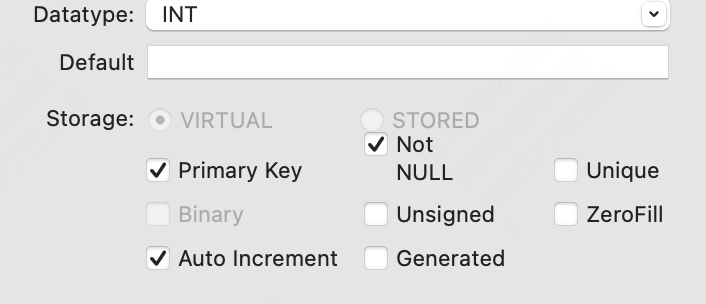

# 表

建表

```sql
CREATE TABLE <表名>
{
字段名1 数据类型 [字段级别约束] [默认值]，
字段名2 数据类型 [字段级别约束] [默认值]，
......
[表级别约束]
};
```

```sql
CREATE TABLE demo.importhead (
listnumber INT,
supplierid INT,
stocknumber INT,
importtype INT DEFAULT 1,
quantity DECIMAL(10,3),
importvalue DECIMAL(10,2),
recorder INT,
recordingdate DATETIME);
```


## 约束

约束就是对数据的限定，包含了：

主键约束，非空约束，唯一性约束，默认约束，自增约束



1.非空约束

顾名思义，不允许为空

2.唯一性约束

这一组数是唯一的，其约束要弱于主键约束：

- 主键针对一列，唯一性约束可以是针对多列，比如（商品 + 数量）维度唯一
- 主键自动要求非空，唯一性并不要求非空

3.自增约束

自动增长，非常方便好使，系统会自动为该列+1

注意事项：

- 只有整数类型可以有自增约束
- 自增约束会自动从最大值开始+1，你也可以自己设置基数，从基数开始自增（AUTO_INCREMENT=xx）


## 改表

有些情况我们需要在已有的表基础上修改表，可以复制表

```sql
CREATE TABLE demo.importheadhist
LIKE demo.importhead;
```


### ALTER

之后可以用ALTER来改表


比如增加字段，可以是

```sql
ALTER TABLE demo.importheadhist
ADD confirmer INT;
```

字段格式就和建表时一样

你还可以指定位置，毕竟顺序其实也很影响数据库查看

```sql
ALTER TABLE demo.importheadhist
ADD suppliername TEXT AFTER supplierid;
```

设置为第一列

ALTER TABLE trans
MODIFY memberid INT FIRST;


修改字段（修改列明和约束）

```sql
ALTER TABLE demo.importheadhist
CHANGE quantity importquantity DOUBLE;
```


修改字段（修改约束）

```sql
ALTER TABLE demo.importheadhist
MODIFY importquantity DECIMAL(10,3);
```


## 表级别约束

于初学者来说，掌握了今天的内容，就足够对数据表进行操作了。不过，MySQL支持的数据表操作不只这些，我来举几个简单的小例子，你可以了解一下，有个印象。

比如，你可以在表一级指定表的存储引擎：

```
ALTER TABLE 表名 ENGINE=INNODB;
```

你还可以通过指定关键字AUTO_EXTENDSIZE，来指定存储文件自增空间的大小，从而提高存储空间的利用率。
