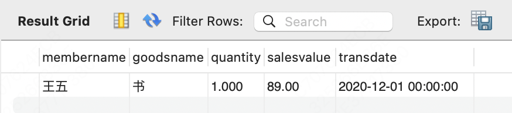

# 主键

三种思路：**业务字段做主键**、**自增字段做主键**和**手动赋值字段做主键**。


## 业务字段做主键

​	比如张三注册了会员卡，卡号是10001，超市的数据库以会员卡号为主键。


​	过了一段时间张三搬家了，他把会员卡退掉了，超市把10001给了王五，在会员信息表做出了信息修改，看上去好像没有问题了


​	商家有一张流水表，用来记录消费记录，这里面有张三的消费记录


年底统计的时候，我们需要获取完成的消费信息，于是做了联表查询

```sql
SELECT b.membername, c.goodsname, a.quantity, a.salesvalue, a.transdate
FROM demo.trans AS a
JOIN demo.membermaster AS b
JOIN goodsmaster AS c
ON (a.cardno = b.cardno AND a.itemnumber = c.itemnumber);
```


​	因为卡换成了王五，所以信息也跟着变了



​	这样的话显然信息就不对了


​	业务信息出现变更的概率很大，因此往往不能用来作为主键


## 自增主键

自增主键看上去是一个解决方案

前提是你只有一个门店


如果是一家连锁超市的话，每个店都用自增主键，汇集起来的自增主键会重复


## 手动配置

手动赋值字段做主键

为了解决这个问题，我们想了一个办法：取消字段“id”的自增属性，改成信息系统在添加会员的时候对“id”进行赋值。

具体的操作是这样的：在总部MySQL数据库中，有一个管理信息表，里面的信息包括成本核算策略，支付方式等，还有总部的系统参数，我们可以在这个表中添加一个字段，专门用来记录当前会员编号的最大值。

门店在添加会员的时候，先到总部MySQL数据库中获取这个最大值，在这个基础上加1，然后用这个值作为新会员的“id”，同时，更新总部MySQL数据库管理信息表中的当前会员编号的最大值。

这样一来，各个门店添加会员的时候，都对同一个总部MySQL数据库中的数据表字段进行操作，就解决了各门店添加会员时会员编号冲突的问题，同时也避免了使用业务字段导致数据错误的问题。


